# 机器学习复习

## 决策树

### 概述

决策树是一个分类模型。对于给定训练数据集$D={(x_1,y_1),(x_2,y_2),...,(x_N,y_N)}$，决策树模型的目标是生成一棵树，根据属性对样本点进行分类，期望能够对训练数据有很好的拟合，并且对未知测试数据能进行很好的预测。这棵树包括**内部结点**和**叶结点**，在内部结点处根据样本点的特征取值将其划分入子结点最终到达叶结点，每个叶结点都表示一个决策结果，每条路径都对应一个决策过程。

下图是一个决策树的示意图。黄色的内部结点代表划分依据的属性，结点之间的箭头表示根据属性值划分的过程，蓝色的叶结点代表决策结果。

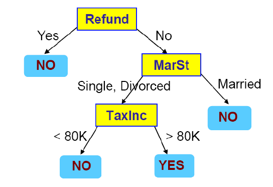

事实上，对于任何训练数据，都可以构建出一个完全拟合所有样本的决策树。正如下图所示，根据真值表构造决策树，使从根节点到每个叶结点的路径与训练样本一一对应。

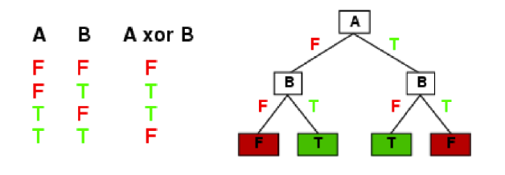

但是，这样的决策树虽然对训练数据的拟合度很高，但很有可能不具有泛化能力，对未知数据的预测准确率很低（也就是出现了**过拟合**现象）。因此，我们真正希望的是通过一种策略找到一个相对紧凑、层数较少的决策树，在保证训练数据拟合度的同时提升其泛化能力。

### 算法流程

决策树算法是一个**分而治之的递归过程**。这是因为决策树的参数空间很大，在有n个布尔值的情况下就会有$2^{2^n}$种决策树，因此最优决策树的搜索是一个NP完全问题，在现实中只能采用启发式方法或贪心策略近似求解。

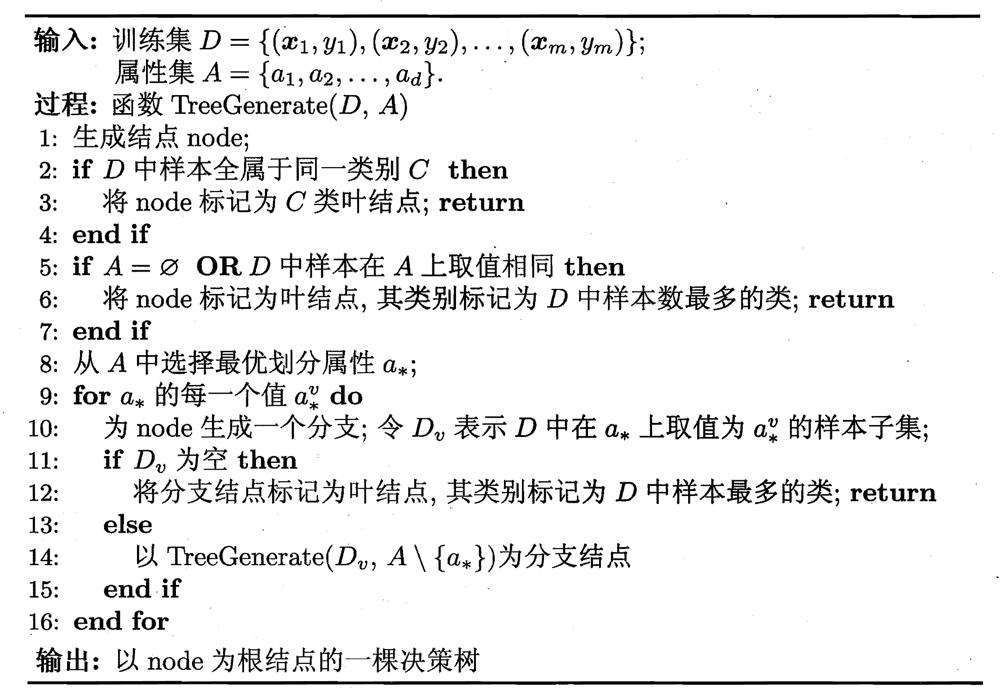

在以下三种情况中，结点无法被继续划分，**递归终止**并进行**类别标记**：（2）结点中所有样本属于相同的类，这时将结点标记为该类别；（2）属性值已经全部被用过一次，或结点中所有样本在所剩属性上取值相同，这时无法根据属性划分样本，因此将结点标记为样本数最多的类别（**后验**）；（3）某个属性中没有相应样本，这时将结点标记为父结点中样本数最多的类别（**先验**）。

在决策树生成算法中，每次生成结点之前都要选择最优划分属性，根据样本在这个属性上的取值进行划分。因此，属性的选择对于生成的决策树的优劣至关重要。下面我们来探讨选择属性的标准。

### 属性选择

直觉上，一个比较好的划分应该满足划分后的子结点中样本**纯度**尽量高，即属于同类的样本数量尽量多，最理想的情况是所有样本都是同类的。在决策树中，通常根据**信息增益**来衡量划分属性的好坏。

为了引出信息增益，我们首先来介绍**熵**的有关概念。

#### 熵，条件熵，互信息

**熵**

熵可以从三种角度来理解，分别是热力学角度、信息论角度和编码角度。

1. **热力学**

   用于反映不确定性和无序性。

   热力学角度太数学了，以后有时间可以细看PRML的推导过程。这里主要从信息论角度和编码角度来解释熵的概念。

2. **信息论**

   在信息论中，熵用来衡量随机变量提供的信息量。直觉上，概率越低的事件包含的信息量越大，因此熵应该与概率呈负相关。用$h(x)$表示事件$x$提供的信息，同样根据直觉，两个事件同时发生提供的信息应该等于这两个事件分别发生提供的信息之和，即$h(x,y)=h(x)+h(y)$，而由于独立事件满足$p(x,y)=p(x)p(y)$，可以推测$h(x)$应该与$p(x)$的**对数**有关。根据这些直觉，不难理解$h(x)$的定义：
   $$
   h(x)=-log_2p(x)
   $$
   将事件$x$扩展为随机变量$X$，就可以得到随机变量$X$的熵的定义:
   $$
   H(X)=-\sum_{i=1}^{N}{p(X=x_i)log_2p(X=x_i)}
   $$
   可以看出，熵就是随机变量提供的平均信息量，是$h(x)$在概率分布$p(x)$下的期望。

3. **编码**

   从编码的角度看，熵是传输信息在**最短编码**的情况下，编码的平均长度（对数以2为底就代表以0、1编码，这时的最短编码是哈夫曼编码）。此时，$h(x)$表示每个传输信息的码字长度，$H(x)$是所有传输信息码字长度的期望。

**条件熵**

随机变量$X$在给定$Y=y_j$下的**特定条件熵**被定义为：
$$
H(X|Y=y_j)=-\sum_{i=1}^{N}{p(X=x_i|Y=y_j)log_2p(X=x_i|Y=y_j)}
$$
随机变量$X$在给定$Y$下的**条件熵**被定义为：
$$
H(X|Y)=-\sum_{j=1}^{M}{p(Y=y_j)H(X|Y=y_j)}
$$
条件熵可以理解为在给定$Y$的情况下，$X$能够提供的平均信息量。

**互信息**

X和Y的互信息被定义为：
$$
I(X;Y)=H(X)-H(X|Y)=H(Y)-H(Y|X)
$$
互信息可以理解为$X,Y$互相提供的信息。

#### 信息增益

由于$X,Y$的互信息$I(X;Y)$表示$X,Y$互相提供的信息，因此可以用互信息来衡量划分属性提供给类别的信息增益。设训练数据集为$D$，属性集为$A$，则属性$a \in A$对数据集$D$的信息增益被定义为二者的互信息：
$$
\begin{align}

Gain(D,a)
&= H(D)-H(D|a)\\
&=H(D)-\sum_vp(a=a^v)H(D|a=a^v)\\
&=Entropy(D)-\sum_v\frac{D^v}{D}Entropy(D^v)\\

Entropy(D)
&=-\sum_k{p_klog_2p_k}
\end{align}
$$
信息增益表示的就是某个属性$a$提供给数据集$D$的信息，信息增益越大，表示属性提供的关于样本类别的信息越多，划分后的“**纯度提升**”也就越高。

**ID3决策树**就是利用信息增益来选择划分属性：
$$
a^*=\mathop{argmax}_\limits{a \in A} \ Gain(D,a)
$$
然而，可取值数目较多、分支较多的属性具有更高的信息增益，因此这些属性更倾向于被选出。但是，这可能导致的后果是，为了使纯度提升更高，生成决策树的分支很多，每个结点中的样本数很少，在这样稀疏的决策树中很容易发生过拟合的现象。基于此，也出现了一些对于选择划分属性准则的改进。

#### 增益率

C4.5决策树以增益率作为其选择最优划分属性的标准。首先C4.5决策树引入了属性$a$的**固有值**：
$$
IV(a)=-\sum_v{\frac{D^v}{D}log_2\frac{D^v}{D}}
$$
固有值的形式与熵十分类似。属性的可取值数目越多，属性越分散，固有值也就越大。为了减弱属性可取值数目对于属性选择的影响，增益率被定义为：
$$
Gain\_ratio(D,a)=\frac{Gain(D,a)}{IV(a)}
$$
然而，使用增益率作为选择属性的标准又会出现新的问题，增益率偏向于选择那些可取值数目较少、分支较少的属性。为了减少这种偏好带来的拟合误差，C4.5采用了启发式方法：先选择信息增益大于平均值的属性，再从这些属性中选择增益率较大的属性。

#### 基尼指数

CART决策树提出根据基尼指数选择划分属性，用基尼值来度量数据集的纯度：
$$
\begin{align}
Gini(D)
&=\sum_k\sum_{k'≠k}p_kp_{k'}\\
&=1-\sum_kp_k^2
\end{align}
$$
基尼值可以理解为，从数据中随机选择两个样本点，它们属于不同类的概率。基尼值越小，则纯度越高。

属性$a$的基尼指数定义为：
$$
Gini\_index(D,a)=\sum_v{\frac{D^v}{D}Gini(D^v)}
$$
基尼指数越小，则根据属性$a$划分得到的子类的平均纯度越高，选择所有属性中基尼指数最小的作为最优划分属性：
$$
a^*=\mathop{argmin}\limits_{a \in A}\ Gini\_index(D,a)
$$

### 剪枝处理

在生成决策树的过程中，直到子类不能继续划分或者划分准则达到某个阈值才会停止划分，这样产生的决策树某些时候会具有比较大的深度。根据奥卡姆剃刀准则，越深的决策树越复杂，越可能出现过拟合现象，被数据中的误差干扰，导致对训练数据拟合得很好，但在测试数据上准确率较低。这时，我们可以采用剪枝策略降低决策树的复杂度。

**预剪枝**

在ID3、C4.5等决策树的实际执行过程中， 当**信息增益小于某个人为设定的阈值$\epsilon$时**就会停止划分，将该结点标记为样本数最多的类别。这实际上就是一个预剪枝的过程。

预剪枝是在生成决策树的过程中，根据某个准则决定是对当前结点进行划分，还是停止划分，将当前结点设置为叶结点并标记为样本数最多的类别。

**后剪枝**

后剪枝是在决策树生成完毕后，对每个结点的划分依次检查，决定是保留该结点，还是将该结点退化为叶结点并标记为样本数最多的类别。

后剪枝的评判标准之一是退化该结点后，验证集精度是否降低。如果能够保证验证集精度不变甚至提升，就会进行剪枝。

此外，后剪枝也可以设定一个损失函数作为评判准则。一般根据MDL(Minimum Description Length)将损失函数设定为：
$$
Cost(Model,Data)=Cost(Data|Model)+Cost(Model)=C_{\alpha}(T)
\\Cost(Data|Model)=\sum_t^T{N_tEntropy(D_t)}=C(T)
\\Cost(Model)=\alpha T
$$
其中$T$代表叶结点个数，$N_t$代表第$t$个叶结点中的样本数目。$C_{\alpha}(T)$可以理解为对训练数据分类的平均混杂度，$\alpha T$是当决策树复杂度过高时添加的惩罚（欠拟合与过拟合之间的trade-off由超参数$\alpha$来调节）。剪枝过程中，遍历每个内部结点，计算剪枝前后$C_{\alpha}(T)$的大小，如果退化内部结点后损失函数变小，则进行剪枝。

### 缺失值处理

数据集中存在样本点在某些属性上缺失是十分常见的情况，如果排除有缺失值的样本、只保留完整的样本，会造成对数据很严重的浪费。因此，我们需要改进决策树算法，使之也适用于有缺失值的情况。这就需要明确，在有属性缺失时：（1）如何进行最优划分属性的选择；（2）如何确定属性值缺失的样本点被划分入哪一个子结点。

**属性选择**

定义$D$表示数据集，$\widetilde D$表示无缺失的数据。首先为数据集中每个样本点确定一个权值$w_x$，接下来定义3个量：
$$
\rho=\frac{\sum_\limits{x \in \widetilde D}w_x}{\sum_\limits{x \in D}w_x}
\\ \widetilde p_k=\frac{\sum_\limits{x \in \widetilde D_k}w_x}{\sum_\limits{x \in \widetilde D}w_x}
\\ \widetilde r_v=\frac{\sum_\limits{x \in \widetilde D^v}w_x}{\sum_\limits{x \in \widetilde D}w_x}
$$
修正信息增益如下：
$$
\begin{align}
Gain(D,a)
&=\rho Gain(\widetilde D, a)\\
&=\rho(Entropy(\widetilde D)-Entropy(\widetilde D|a))\\
&=\rho(-\sum_{k}\widetilde p_klog_2\widetilde p_k-(\sum_v{\widetilde r_vEntropy(\widetilde D^v)}))
\end{align}
$$
**划分样本**

如果样本$x$属性值已知，则将其划分到对应的子结点，权值保持为$w_x$；如果样本$x$属性值缺失，则将其划分到所有子结点，权值更新为$\widetilde r_vw_x$，即根据属性值的先验分布将样本以不同的概率划分入每个子结点。

## 线性回归

曲线拟合是一个经典的线性回归问题（是关于参数的线性函数）。训练集中包括$\bold x$和对应的$\bold t$的$N$次观测$D={(x_1,t_1),(x_2,t_2),...,(x_N,t_N)}$，目标是得到$\bold x$的连续函数，以表征$x$和$t$之间的关系。但是由于训练数据中的$\bold t$带有随机噪声，二者的函数关系并没有那么显然。这里我们只探讨用多项式函数进行曲线拟合的过程。

之所以可以利用多项式函数拟合，是因为根据**泰勒公式**，如果函数在某一点的各阶导数值已知，可以用这些导数值做系数构建一个多项式来近似函数在这一点的邻域中的值。

### 最优解推导

定义多项式函数：
$$
y(x,\bold w)=w_0+w_1x+w_2x^2+...+w_Mx^M=\sum_{i=0}^{M}{w_ix^i}
$$
为使拟合结果尽可能精确，根据最小二乘法，我们定义损失函数为预测与目标之间的平方距离之和：
$$
\begin{align}
E(\bold w)
&=\frac{1}{2}\sum_{i=n}^{N}||y(x_n,\bold w)-t_n||^2\\
&=\frac{1}{2}(\bold X \bold w - \bold t)^T(\bold X \bold w - \bold t)\\
&=\frac{1}{2}(\bold w^T\bold X^T\bold X \bold w-\bold w^T\bold X^T\bold t-\bold t^T\bold X \bold w+\bold t^T\bold t)\\
&=\frac{1}{2}(\bold w^T\bold X^T\bold X \bold w-2\bold t^T\bold X \bold w+\bold t^T\bold t)\\
\\
\bold X&=
	\begin{bmatrix}
	1 & x_1 & x_1^2 & ... & x_1^M \\
	1 & x_2 & x_2^2 & ... & x_2^M \\
	\vdots & & & & \vdots\\
	1 & x_N & x_N^2 & ... & x_N^M \\
	\end{bmatrix}_{N*(M+1)}
\end{align}
$$
其中$\bold X$为所有样本点的范德蒙矩阵，维度为$N*(M+1)$。$\bold w$为$M+1$维列向量，$\bold t$为$N$维列向量。展开过程中，由于$\bold w^T\bold X^T\bold t$和$\bold t^T\bold X \bold w$维度为$1*1$且互为转置，故二者相等可以合并。

则参数$\bold w$应该在损失函数关于其偏导为0处的极值点取值：
$$
\frac{\partial E(\bold w)}{\partial \bold w}=\bold X^T \bold X \bold w - \bold X^T \bold t = 0 \\
\bold w = (\bold X^T \bold X)^{-1}\bold X^T \bold t
$$

> 可以参考的矩阵求导公式：
>
> 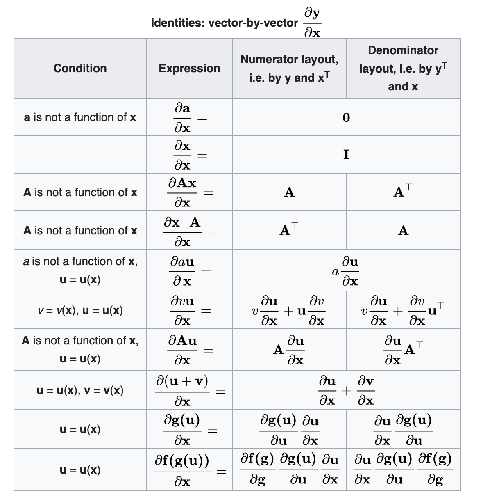
>
> 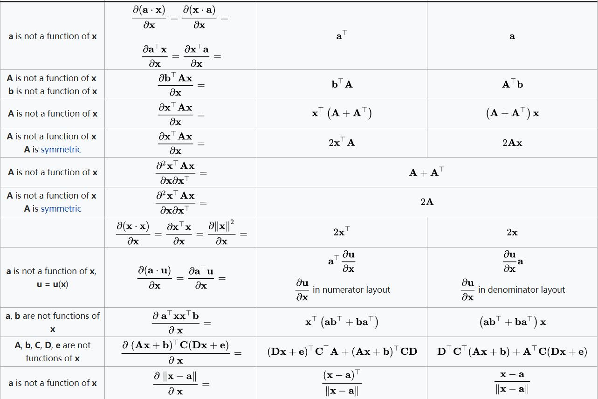

如果$\bold X^T\bold X$为满秩矩阵或正定矩阵，就可以通过解析的方式求出唯一的参数$\bold w$。

对于训练集的拟合效果可以通过方均根(RMS)误差来衡量。均方根误差定义如下：
$$
E_{RMS}=\sqrt{E(\bold w^*)/N}
$$
除以数据量$N$的目的是**以相同的标准度量不同规模的数据集的拟合情况**。

### 欠拟合与过拟合

以正弦函数的拟合为例，提高多项式阶数$M$，会发现阶数很低$M=1,2$时，拟合效果比较差；阶数达到$M=3$时，似乎得到了完美的拟合；但当阶数持续增大$M=9$时，得到的拟合曲线在训练数据上误差为0，但是却震荡剧烈，与正弦曲线毫不相关。这是因为阶数较低时，**模型表达能力有限**，不能学到足够的对于数据的知识，这种现象叫做**欠拟合**；阶数较高时，训练集误差小，但**模型学习力过强，甚至学习到了训练数据自身的、非全局的特征**，导致测试集误差大，这种现象叫做**过拟合**。

欠拟合可以通过增加模型复杂度、增加训练时间来解决；过拟合可以通过增加数据量、添加模型复杂度的惩罚来缓解。

模型复杂度与模型参数个数密切相关，因而可以被量化为**模型参数的绝对值（范数）**，并且参数多时，最优解的绝对值往往也比较大。在拟合正弦函数的例子中，我们可以通过在损失函数中添加正则化项来减弱过拟合现象，正则化项被设定为参数$\bold w$二范数的平方，通过系数$\lambda$调节。

> 正则化项如果采用一范数会导致**稀疏解**。一范数会使得许多参数的最优解都在0处取，进而将很多参数优化为0。（还没有细看数学解释，直观理解就是一范数$|x|$很有“棱角”，有很大概率在极端值处取最优解 ）。

添加正则化项后的损失函数被修正为：
$$
\begin{align}
\widetilde E(\bold w)
&=\frac{1}{2}\sum_{i=n}^{N}||y(x_n,\bold w)-t_n||^2+\frac{\lambda}{2}||\bold w||^2\\
&=\frac{1}{2}(\bold w^T\bold X^T\bold X \bold w-2\bold t^T\bold X \bold w+\bold t^T\bold t)+\frac{\lambda}{2}\bold w^T\bold w\\
\end{align}
$$
求导为0，解得$\bold w$的最优解为：
$$
\frac{\partial \widetilde E(\bold w)}{\partial \bold w}=\bold X^T \bold X \bold w - \bold X^T \bold t + \lambda \bold w = 0 \\
\bold w=(\bold X^T \bold X+\lambda)^{-1}\bold X^T\bold t
$$
系数$\lambda$属于超参数，通过调节$\lambda$，可以改变正则化项所占比重。如果比重过小，则惩罚不显著，退化为原模型；如果比重过大，则会过度降低模型复杂度，甚至出现欠拟合。因此要通过取值适当的$\lambda$使模型复杂度与具体问题匹配，控制欠拟合与过拟合之间的trade-off。

在实践过程中，一般将训练数据分成训练集和开发集，在训练集上训练、开发集上验证，通过比较不同超参数取值下的验证集结果来选择像$\lambda$这样的超参数。

## 概率论

### 基本概念

**概率的基本定义**

**随机变量**：离散，连续

**概率分布**：均匀分布，高斯分布，指数分布，伯努利分布，……

**中心极限定理**

**独立性**

**条件概率与条件独立性**

**贝叶斯定理**

**联合分布与边缘分布**

### 估计概率分布

机器学习的主要目标就是学习到训练数据的特征，即其概率分布，进而对测试数据求算概率，进行估计。

#### 最大似然(MLE)

**方法**：求算出样本数据的似然函数（通常情况下，为了计算简便，采用对数似然函数），进而期望利用解析或优化的方法求出参数最优解。在训练集上，得到使似然函数尽可能大的参数；在测试集上，用似然函数进行预测。

> 样本数据为一元时，似然函数表示为：$P(X|\theta)$
>
> 样本数据为二元时，似然函数表示为：$P(Y|\theta,X)$【最大条件似然MCLE】

**缺陷**：似然函数只利用了数据，缺少对于参数的先验知识，很容易出现过拟合的现象。例如，在伯努利分布中，如果观测次数很少，采样到样本取某个值的次数为0，最大似然估计将会得到取该值的概率为0，这显然是不符合直觉的。

#### 最大后验(MAP)

**方法**：在最大似然的基础上添加关于参数的先验，期望利用解析或优化的方法求出参数最优解。在训练集上，得到后验概率尽可能大的参数；在测试集上，仍然用似然函数进行预测。

**缺陷**：先验分布的选择可能会对结果产生很大影响。

#### 比较MLE与MAP

假设$\theta$为意图估计的参数，$D$为训练数据集，根据贝叶斯定理：
$$
P(\theta|D)=\frac{P(D|\theta)P(\theta)}{P(D)}
$$
其中$P(\theta)$为参数$\theta$的先验分布，$P(D|\theta)$为似然函数，$P(\theta|D)$为参数$\theta$在观测到数据$D$下的后验分布。相同的训练数据下，$P(D)$为固定值。

最大似然的形式化表示为：
$$
\theta^*_{MLE}=\mathop {argmax} \limits _\theta P(D|\theta)
$$
最大后验的形式化表示为：
$$
\theta^*_{MAP}=\mathop {argmax} \limits _\theta P(\theta|D)
$$
可见，在最大似然的基础上，最大后验需要选择$\theta$的先验分布。通常情况下，我们倾向于选择与似然函数形式相似的函数作为**共轭先验**，例如伯努利分布的共轭先验为$\beta$分布，多项式分布的共轭先验为狄利克雷分布（多元$\beta$分布）。

## 贝叶斯分类器

### 贝叶斯决策论

#### 最小化错误率

贝叶斯决策论考虑如何基于概率选择最优的决策类别。

首先定义对样本分类的错误率。以下图所示二分类情况为例。若以虚线作为决策面，虚线左侧被分为类别$y=1$，虚线右侧被分为类别$y=2$，则错误出现在A, B, C, D范围内。若以实线作为决策面，则错误出现在A, B, C范围内。

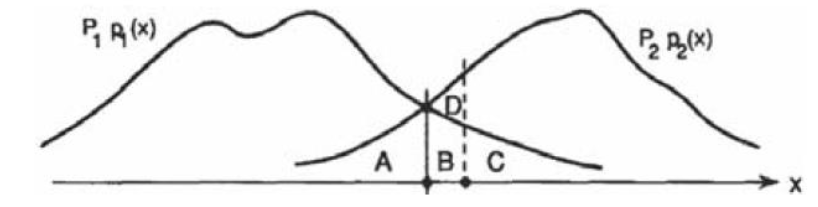

定义类别的后验概率为：
$$
P(y=1|\bold X) = \frac{P(y=1)P(\bold X|y=1)}{P(\bold X)}=\frac{\pi_1p_1(\bold X)}{P(\bold X)}=q_1(\bold X)\\
P(y=2|\bold X) = \frac{P(y=2)P(\bold X|y=2)}{P(\bold X)}=\frac{\pi_2p_2(\bold X)}{P(\bold X)}=q_2(\bold X)
$$
则错误率为：
$$
r(\bold X)=min[q_1(\bold X),q_2(\bold X)]
$$
错误率的期望为：
$$
\begin{align}
\epsilon=E_{\bold X}(r(\bold X))
&=\int r(x)p(x) dx \\
&= \int min[\pi_1p_1(x), \pi_2p_2(x)]dx\\
&=\pi_2\int_\limits {L_1} p_2(x) + \pi_1\int_\limits {L_2} p_1(x) \\
&= \pi_1\epsilon_1+\pi_2\epsilon_2
\end{align}
$$
如图示可知，当以两条曲线的交点处作为决策面时错误率期望最小。这时的分类准则是，选择错误率最小即后验概率最大的类作为分类结果。这就叫做贝叶斯分类准则。
$$
h^*(\bold x)=\mathop {argmax} \limits _{c \in y}P(c|\bold x)
$$
#### 最小化期望损失

有些情况下，误分类的情况不同，带来的损失也不同。这时就不能简单地用最小错误率来衡量分类效果，需要为每种误分类的情况赋予一定的权值。设$\lambda_{ij}$为将原本属于$c_j$类的样本误分入$c_i$的损失，则将$\bold x$分入$c_i$类所带来的损失为：
$$
R(c_i|\bold x)=\sum_{j=1}^N{\lambda_{ij}P(c_j|\bold x)}
$$
将决策函数定义为$h(\bold x)$，则所有样本的总体期望损失为：
$$
R(h)=E_{\bold x}[R(h(\bold x)|\bold x)]
$$
这种情况下的决策准则为，选择期望损失最小的类作为分类结果：
$$
h^*(\bold x)=\mathop {argmax} \limits _{c \in y}R(c|\bold x)
$$
最小错误率的情况可看作是将损失定义为如下形式：
$$
\lambda _{ij} = \left \{
\begin{array}{ll}
    0,     & i=j\\
   	1,     & i≠j\\
\end{array}
\right.
$$
同理，在二分类的情况下，以$R(c_1|\bold X)=R(c_2|\bold X)$处作为决策面时期望损失最小。

### K近邻方法

K近邻方法本是估计概率密度的非参数方法之一，可以被推广到分类问题。

#### 非参数方法估计概率密度

在使用参数方法估计概率密度时，需要对概率分布的模型做出符合某种函数假设，利用最大似然或最大后验的方法估计其中的参数。这就对于模型的假设的准确程度有很高的要求，存在一定的限制，如果假设与数据分布特征相差甚远，仍然会得到很差的结果。因此，使用非参数方法估计概率密度的想法就产生了。

非参数估计的公式主要是利用**微元**和**二项分布**的思想推导得到的。考虑一个很小的区域$\mathcal{R}$，假设样本的概率密度为$p(\bold X)$，则其中的一个样本点$\bold x$在区域$\mathcal{R}$中的概率为：
$$
P=\int _\mathcal {R} p(\bold x)d \bold x
$$
样本中的每个样本点是否属于区域$\mathcal{R}$这个事件实际上符合一个伯努利分布，且$P(\bold x \in \mathcal{R})=P$。假设对样本进行了$N$次观测，其中属于区域$\mathcal{R}$的样本点共有$K$个，则$K$符合二项分布：
$$
Bin(K,|N,P)=C_N^KP^K(1-P)^{N-K}
$$
根据二项分布的性质，我们可以得到$K$的均值和方差，进而求出属于区域$\mathcal{R}$的样本点的比例$\frac{K}{N}$的均值和方差：
$$
E(K)=NP \ \Rightarrow \ E(\frac{K}{N})=P
\\
D(K)=NP(1-P) \ \Rightarrow \ D(\frac{K}{N})=\frac{P(1-P)}{N}
$$
观测次数$N$越大，$\frac{K}{N}$的方差越小，该随机变量所有取值都向均值靠拢形成尖峰，因此可以近似得到：
$$
\frac{K}{N}=P
$$
又，当区域$\mathcal{R}$很小时，$p(\bold x)$趋近于一个常量，因此可以近似得到：
$$
\frac{P}{V}=p(\bold x)
$$
其中$V$为区域$\mathcal{R}$的体积。

综合上述两个假设条件，我们可以得到：
$$
p(\bold x)=\frac{K}{NV}
$$

> 实际上这两个假设**相互矛盾**。为使$p(\bold x)$趋近于常量，区域$\mathcal{R}$需要足够小；但为了使落在区域内的样本点更可能达到二项分布尖峰处的$K$，区域$\mathcal{R}$又要足够大。【这里不是很懂为什么要足够大】

非参数估计方法主要分为两种，分别是核密度估计（核方法）以及K近邻方法，它们都是基于上面的公式。核密度估计是固定$V$，从数据中确定$K$；K近邻是固定$K$，从数据中确定$V$。

#### 核密度估计

核密度估计（Parzen窗）中，通过核函数$\kappa(\bold x)$来调节区域中数据点的个数$K$。比较常见的核函数有均匀核函数和高斯核函数等。
$$
\hat p(\bold x)=\frac{\kappa(\bold x)}{NV}
$$
区域的体积$V$是根据预设的区域形状来计算的，与数据点的取值无关。

#### K近邻

K近邻方法中，固定区域中数据点的个数$K$，根据函数$V(\bold x)$来调节区域的体积$V$。
$$
\hat p(\bold x)=\frac{K}{NV(\bold x)}
$$

> K近邻方法不能得到真正的概率分布模型，可以证明它在空间内的积分是发散的。但是核密度估计可以得到处处非负、积分为1的概率密度函数。

**K近邻分类器**

类先验概率为：
$$
p(C_k)=\frac{N_k}{N}
$$
给定一个新的数据点$\bold x$，我们根据K近邻方法估计其似然函数和概率密度。
$$
p(\bold x|C_k)=\frac{K_k}{N_kV}
\\
p(\bold x) = \frac{K}{NV}
$$
其中$V$表示预先设定的$\bold x$的邻域（即区域$\mathcal{R}$）的体积，$K_k$和$K$分别表示该邻域内第$k$类的样本点和总样本点的个数，$K$是预先设定的，$K_k$是观测得到的。

根据贝叶斯定理，可以得到类后验概率为：
$$
\begin{align}
p(C_k|\bold x)
&=\frac{p(\bold x|C_k)p(C_k)}{p(\bold x)} \\
&= \frac{K_k}{K}
\end{align}
$$
因此K近邻实际上就是选定数据点的一个邻域，使这个邻域中精确包含共$K$个样本点。这个邻域中第$k$类样本点所占的比例即为该数据点属于第$k$类的后验概率。从其中选择后验概率最大的类作为$\bold x$的分类结果。

可以证明，**最近邻分类器的错误率不超过贝叶斯最优分类器错误率的2倍**（证明方法见西瓜书）。

**邻域的选择**

在K近邻分类器中，对于$\bold x$的邻域选择无疑十分关键。一般都取以一定距离为半径的球体作为$\bold x$的邻域，使其包含$K$个样本点。那么这个距离应该如何选择？

最常见的是使用**欧氏距离**作为度量：
$$
L_2(x_i,x)=(\sum_{l=1}^n|x_i^{(l)}-x^{(l)}|^2)^\frac{1}{2}
$$
但是当$\bold x$是高维向量时，由于各维度的尺度可能不同，统一标准下的欧式距离不能表征数据点之间真正的距离。如下图所示，取原点为基准点。在两个维度上，由于数据分布的方差不同，即使A和B与原点的欧氏距离相同，看起来在这个数据分布下，A应该比B的距离更远。因此要对距离在每个维度上进行标准化，除以该维度的方差。

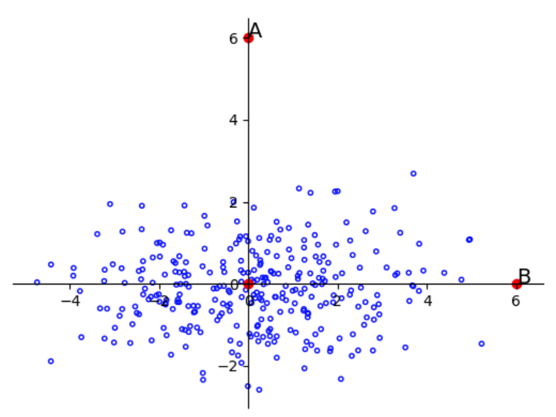

但是仅仅标准化是不够的，因为数据点的不同维度之间可能是并不独立的。这时还需要考虑不同维度的相关性，将数据点沿着**主成分**而不是维度的方向进行标准化，这是因为**不同主成分方向相互正交，彼此独立**。

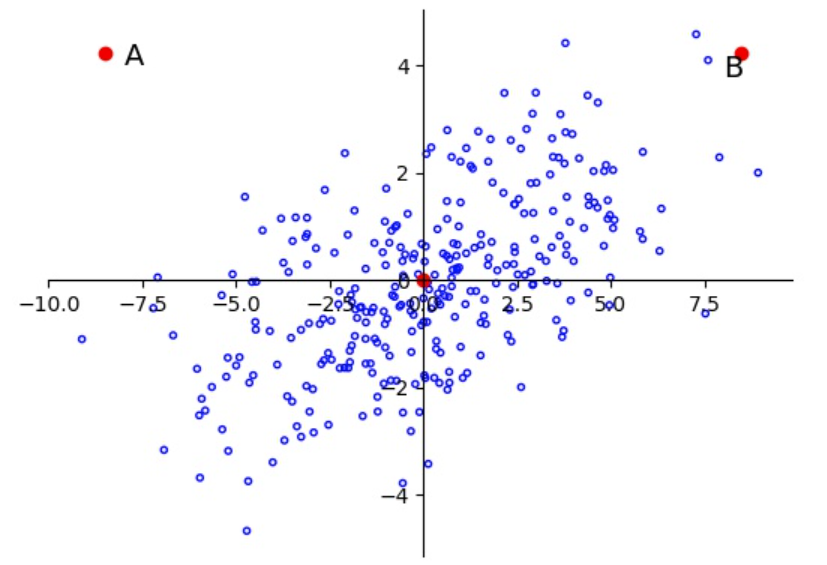

马氏距离正是用于解决这个问题的。定义马氏距离为：
$$
D(x_i,x)=\sqrt{(x_i-x)^T\Sigma_x^{-1}(x_i-x)}
$$
与协方差的逆矩阵相乘即为将数据点在主成分方向进行标准化的过程。如果协方差矩阵为单位阵，马氏距离等价于欧氏距离；如果协方差矩阵为对角阵，说明数据在不同维度上独立，马氏距离等价于标准化的欧氏距离。最终可以直观理解为将上述数据转化为下图的形式：

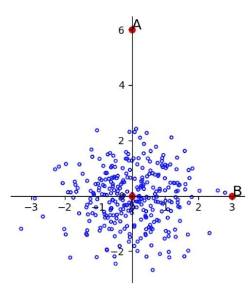

关于马氏距离的理解可以参考：https://zhuanlan.zhihu.com/p/46626607

### 朴素贝叶斯分类器

朴素贝叶斯是基于贝叶斯公式的**生成式模型**。在朴素贝叶斯模型中，首先假设不同维度的样本之间互相条件独立，然后通过最大似然或最大后验分别估计类先验概率与似然函数，进而得到类后验概率，选择后验概率最大的类作为分类结果。

#### 朴素贝叶斯假设

首先基于贝叶斯定理写出类后验概率：
$$
P(y|\bold x)=\frac{P(y)P(\bold x|y)}{P(\bold x)}
$$

如果$\bold x$是$d$维向量，则
$$
P(\bold x|y)=P((x_1,x_2,...,x_d)|y)
$$
这时的似然函数是$\bold x$的联合条件概率，若要估计联合概率，即使每个维度都是布尔函数，一共也有$2^d$种取值，则一共需要估计$2^d-1$个参数。为了简化模型，假设不同维度之间相互条件独立，则联合概率可以被拆分：
$$
P(\bold x|y)=P(x_1|y)P(x_2|y)...P(x_d|y)
$$
这时需要估计的参数减少为$d$个，可以大大简化计算量。

#### 模型参数估计

根据最大的类后验概率对数据点$x$进行分类：
$$
\begin{align}
y^*
&=\mathop{argmax}\limits_y \ P(y|\bold x)\\
&=\mathop{argmax}\limits_y \ P(y)P(\bold x|y)
\end{align}
$$
再朴素贝叶斯模型中，分别对类先验概率$P(y)$和似然函数$P(\bold x|y)$进行估计。

对于每个类别，定义其类先验概率为:
$$
\pi_k=P(y=y_k)
$$
定义似然函数为：
$$
\theta_{ijk}=P(x_i=x_{ij}|y=y_k)
$$
则需要估计的量有：（1）样本属于第$k$类的概率；（2）在第$k$类的样本中，样本第$i$个维度取第$j$个可能值的概率。**不同的类别和不同的维度都是分别计算的**。

我们首先讨论最大似然的方法。
$$
\theta^*=\mathop{argmax}\limits_{\theta}P(D|\theta)
$$
用$\pi_k$和$\theta_{ijk}$表示似然函数并分别求导，得到最大似然估计的结果为：
$$
\theta_{ijk}^*=\frac{\#D(x_i=x_{ij} \and y=y_k)}{\#D(y=y_k)}
\\
\pi_k^*=\frac{\#D(y=y_k)}{|D|}
$$
然而，最大似然存在的问题是，如果观测到的数据点总量较少，某种情况下的样本从未被观测到，其概率会被估计为0，这显然是不符合直觉的。因此，我们要为参数添加先验，改进为最大后验的方法。
$$
\theta^*=\mathop{argmax}\limits_{\theta}P(\theta|D)=\mathop{argmax}\limits_{\theta}P(\theta)P(D|\theta)
$$
如果似然函数是伯努利分布（$x_i$,$y$是布尔函数）的形式，则用$\beta$分布作为先验；如果似然函数是一个多项式分布的形式，则用狄利克雷分布作为先验，得到最大后验估计的结果为：
$$
\hat \theta_{ijk}=\frac{\#D(x_i=x_{ij} \and y=y_k)+\alpha_j'}{\#D(y=y_k)+\sum_d{\alpha_d'}}
\\
\hat \pi_k=\frac{\#D(y=y_k)+\alpha_k}{|D|+\sum_K{\alpha_K}}
$$

#### 不符合朴素贝叶斯假设的数据

当样本数据满足朴素贝叶斯条件独立的假设，并且训练数据足够多时，朴素贝叶斯模型的错误率可以达到贝叶斯最小错误率。

当样本数据不满足各特征维度相互条件独立的假设时，朴素贝叶斯模型可能会导致**决策颠倒**。如果假设数据中某两个维度满足$x_i=x_j$，可以推导出最终结果存在决策颠倒的可能性。

#### 连续情况

在离散情况中，我们假设似然函数满足伯努利分布或者多项式分布。但是如果数据的某个维度的特征值在空间内连续取值如何？在这种连续情况下，基于中心极限定理，我们可以假设该维度满足高斯分布：
$$
P(x_i|y=y_k)=\frac{1}{\sqrt{2\pi}\sigma_{ik}}e^{-\frac{1}{2\sigma_{ik}^2}(x-\mu_{ik})^2}
$$
其中$\mu_{ik}$和$\sigma_{ik}^2$为待估计的参数，表示第$k$类的样本点在第$i$维特征上的均值和方差。最大似然估计的结果为：
$$
\hat\mu_{ik}=\frac{\sum_nx_i^{(n)}\delta(y^{(n)}=y_k)}{\sum_n\delta(y^{(n)}=y_k)}
\\
\hat \sigma^2_{ik}=\frac{\sum_n(x_i^{(n)}-\hat\mu_{ik})^2\delta(y^{(n)}=y_k)}{\sum_n\delta(y^{(n)}=y_k)}
$$
这时的假设就变为，类先验满足伯努利分布，似然函数的每个特征的分布都满足高斯分布。当属于不同类别数据在同一特征维度上方差相同，即$\forall i, \sigma_{ik}=\sigma_i$时，可以得到一个线性分类器。

#### 应用：文本分类

**词袋模型（bag of words）**
$$
P(+|doc) \propto P(doc|+)P(+)
\\
P(doc|+)=\prod_{i}^{length(doc)}P(w_i|+)
$$
将文本拆分成不同的词。由于词的顺序对概率模型不造成影响，因此被称为词袋模型。

使用朴素贝叶斯时，不同的文本可以拆分为不同长度的词的集合，因为每个文本的类后验概率是分别计算的；但是在使用K近邻方法时，由于需要对不同文本的特征向量进行距离的求算，就要求每个文本的特征向量长度相同，因此不同文本需要被拆分为相同长度的词的集合。

## 逻辑回归

逻辑回归是基于贝叶斯定理的**判别式模型**，直接对后验概率$P(Y|X)$建模。

### 模型推导

假设$X$是连续随机变量，$X$的每个特征$x_i$都符合高斯分布$N(\mu_{ik},\sigma_i)$，对$Y$条件独立；$Y$是离散随机变量，有0/1两种取值，符合伯努利分布。在此假设下，$X,Y$线性可分。

> 若不假设$X$关于$Y$条件独立，也可以证明出逻辑回归模型（可以假设$X$符合高维下的高斯分布）

$$
P(Y=1)=\pi 
\\
P(Y=0)=1-\pi
\\
P(X=x_i|Y=1)=\frac{1}{\sqrt{2\pi}\sigma_i}e^{-\frac{1}{2\sigma_i^2}(x_i-\mu_{i1})^2}
\\
P(X=x_i|Y=0)=\frac{1}{\sqrt{2\pi}\sigma_i}e^{-\frac{1}{2\sigma_i^2}(x_i-\mu_{i0})^2}
$$
推导类后验概率的模型：
$$
\begin{align}
P(Y=0|X) 
&= \frac{P(X|Y=0)P(Y=0)}{P(X|Y=1)P(Y=1)+P(X|Y=0)P(Y=0)} \\
&= \frac{1}{1+\frac{P(X|Y=1)P(Y=1)}{P(X|Y=0)P(Y=0)}} \\
&= \frac{1}{1+\exp(ln\frac{P(X|Y=1)P(Y=1)}{P(X|Y=0)P(Y=0)})} \\
&= \frac{1}{1+\exp(\sum_iln\frac{P(X=x_i|Y=1)}{P(X=x_i|Y=0)}+ln(\frac{1-\pi}{\pi}))} \\
\sum_iln\frac{P(X=x_i|Y=1)}{P(X=x_i|Y=0)}
&=\sum_i-\frac{1}{2\sigma_i^2}(x_i-\mu_{i1})^2+\frac{1}{2\sigma_i^2}(x_i-\mu_{i0})^2\\
&=\sum_i\frac{1}{\sigma_i^2}(\mu_{i1}-\mu_{i0})x_i+\frac{1}{2\sigma_i^2}(\mu_{i0}^2-\mu_{i1}^2)
\end{align}
$$
可以看出，类后验概率符合以下形式：
$$
\begin{align}
P(Y=0|X)&=\frac{1}{1+\exp(\sum_{i=1}^dw_ix_i+b)}\\
&=\frac{1}{1+\exp(\bold w^T\bold x+b)}
\end{align}
$$
其中$\bold w,b$即为逻辑回归模型的参数。

**Sigmoid函数**

Sigmoid函数定义为：
$$
S(x)=\frac{1}{1+e^{-x}}
$$
逻辑回归模型也可以看作利用线性模型表征分类结果，线性模型取值为正代表属于正例，线性模型取值为负代表属于负例。实际上，最理想的模型如下：
$$
\ h_\theta(x) = \left \{
\begin{array}{ll}
    0,     & \theta^Tx<0\\
    0.5    &  \theta^Tx=0  \\
   	1,     & \theta^Tx>0\\
\end{array}
\right.
$$
但是该模型是非连续可导的，无法使用梯度下降进行参数估计，因此利用连续的Sigmoid函数来替代上述模型：
$$
h_{\theta}(x)=\frac{1}{1+e^{-\theta^Tx}}
$$
分类时通过设定阈值将$h_\theta(x)$的取值映射为类别标签。

**逻辑回归模型的特点**
$$
P(Y=0|X)=\frac{1}{1+\exp(\bold w^T\bold x+b)}
\\
P(Y=1|X)=\frac{\exp(\bold w^T\bold x+b)}{1+\exp(\bold w^T\bold x+b)}
\\
\frac{P(Y=1|X)}{P(Y=0|X)}=\exp(\bold w^T\bold x+b)
\\
\ln\frac{P(Y=1|X)}{P(Y=0|X)}=\bold w^T\bold x+b
$$
输出$Y$的**对数几率**是由输入$\bold x$的**线性函数**表示的模型。因此逻辑回归的结果是一个**线性决策面**。

### 参数估计

首先令$b=w_0$，并将$\bold w$和$\bold x$进行增广：$\bold w=(w_0,w_1,...,w_d)，\bold x=(1,x_1,...,x_d)$，则：
$$
P(Y=0|\bold x)=\frac{1}{1+\exp(\bold w^T\bold x)}
\\
P(Y=1|\bold x)=\frac{\exp(\bold w^T\bold x)}{1+\exp(\bold w^T\bold x)}
$$
#### 最大条件似然(MCLE)

用最大似然的方法估计参数$W$：
$$
W^*=\mathop{argmax}\limits_WP((X,Y)|W)
$$
然而，在逻辑回归模型中，仅仅设定参数$W$，无法估计$(X,Y)$的联合分布。因此采用最大条件似然来进行参数估计：
$$
W^*=\mathop{argmax}\limits_WP(Y|X,W)
$$
计算对数似然函数：
$$
\begin{align}
l(\bold w)=\ln P(Y|X,\bold w)
&=\sum_{j=1}^Ny^{(j)}\ln P(Y=1|\bold x^{(j)},\bold w)+(1-y^{(j)})\ln P(Y=0|\bold x^{(j)},\bold w) \\
&= \sum_{j=1}^Ny^{(j)}\ln \frac{\exp(\bold w^T\bold x^{(j)})}{1+\exp(\bold w^T\bold x^{(j)})}+(1-y^{(j)})\ln \frac{1}{1+\exp(\bold w^T\bold x^{(j)})} \\
&= \sum_{j=1}^Ny^{(j)}(\bold w^T\bold x^{(j)})-\ln(1+\exp(\bold w^T\bold x^{(j)})) \\
\end{align}
\
$$
在逻辑回归模型中，通常使用梯度下降或牛顿法来求得参数的最优解（因为无法求出对数似然函数取极大值时参数的解析解）。
$$
\frac{\part l(\bold w)}{\part \bold w}=\sum_{j=1}^N\bold x^{(j)}(y^{(j)}-P(Y=1|\bold x^{(j)},\bold w))
$$

#### 最大后验

用最大后验的方法估计参数：
$$
W^*=\mathop{argmax}\limits_WP(W)P(Y|X,W)
$$
采用高斯分布$N(0,\sigma I)$作为先验。
$$
l(\bold w)=\sum_{j=1}^Ny^{(j)}(\bold w^T\bold x^{(j)})-\ln(1+\exp(\bold w^T\bold x^{(j)}))-\frac{\lambda}{2}||\bold w||^2
\\
\frac{\part l(\bold w)}{\part \bold w}=\sum_{j=1}^N\bold x^{(j)}(y^{(j)}-P(Y=1|\bold x^{(j)},\bold w))-\lambda\bold w
$$
#### 损失函数

从Sigmoid的角度构建逻辑回归，则给定样本$x$的分类结果为：
$$
h_{\theta}(x)=\frac{1}{1+e^{-\theta^Tx}}
$$
我们期望这个分类结果与真实的类别标签$y$的分布越接近越好。因此定义损失函数为**交叉熵(cross-entropy)**，它能够衡量两个分布的距离：
$$
loss=-\sum y \log h_\theta(x) + (1-y) \log (1-h_\theta(x))
$$

实际上，真正能够衡量两个分布距离的量是**相对熵（KL散度）**：
$$
\begin{align}
KL(q(x)||p(x))&=\sum q(x)\log \frac{q(x)}{p(x)}\\
&=\sum-q(x)\log p(x)-(-q(x)\log q(x))\\
&=\sum CrossEntropy(q(x),p(x))+Entropy(q(x))
\end{align}
$$
由于对同一个分布$q(x)$，其熵是一个常量，因此最小化KL散度就相当于最小化交叉熵。分类任务中许多模型都是将交叉熵作为损失函数，从而拉近预测分布与真实分布的距离。

### 多分类的逻辑回归

对样本$\bold x$进行$R$分类：$y \in \{y_1,y_2,...,y_R\}$
$$
for \ k<R:\ P(Y=y_k|\bold x)=\frac{\exp(\sum_{i=0}^dw_{ki}x_i+w_{k0})}{1+\sum_j^{R-1}\exp(\sum_{i=0}^dw_{ji}x_i+w_{j0})}
\\
for \ k=R:\ P(Y=y_k|\bold x)=\frac{1}{1+\sum_j^{R-1}\exp(\sum_{i=0}^dw_{ji}x_i+w_{j0})}
$$

## 支持向量机

支持向量机分为三种：线性可分（硬间隔）SVM，线性（软间隔）SVM，以及非线性SVM。我们先从线性可分的情况出发推导支持向量机的基本形式，在逐渐推广到线性不可分和非线性的情形。

### 线性可分支持向量机

在逻辑回归模型中，可以学习到一个线性分类器，对样本进行分类。但实际上，对于一组线性可分的数据，可能存在许多线性决策面可以对其进行分类。但直观看来，这些决策面并不是完全相同的。如下图所示，实线和虚线两个决策面都可以对样本进行正确分类，但我们感觉虚线的决策面似乎更好，因为它能够将两类数据点更明显地分隔开。基于这个直觉，我们来推导支持向量机在线性可分情况下的模型。

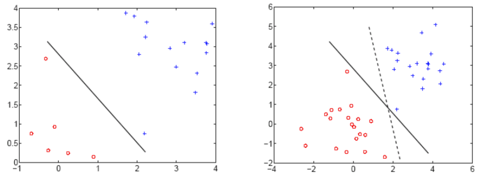

定义线性决策面方程为$\bold w^T\bold x +b=0$，类别标签$y \in \{+1, -1\}$。其中$\bold w$为法向量，表示决策面的方向。则数据点$\bold x$与决策面之间的距离为:
$$
\gamma=\frac{\bold w^T\bold x+b}{||\bold w||}
$$
定义分类标准为：对于数据点$\bold x$，若$\bold w^T\bold x +b≥c$，则$y=+1$；若$\bold w^T\bold x +b≤-c$，则$y=-1$。因此，决策面的选择应满足约束：
$$
y(\bold w^T\bold x+b) ≥ c
$$
为了使决策面能够尽可能将两类数据更显然地分类，我们希望数据与决策面间的距离尽可能远。根据分类标准，使得$y(\bold w^T\bold x+b)=c$的数据点是类别中距离决策面最近的数据点，其与决策面的距离为$\frac{c}{||\bold w||}$。这些数据点被称为**支持向量**，通过后面的证明可以看出，选择决策面时只有支持向量起作用，其他数据点并不起作用。异类支持向量与决策面的距离之和为$\gamma=\frac{2c}{||\bold w||}$，被称为**间隔(margin)**。

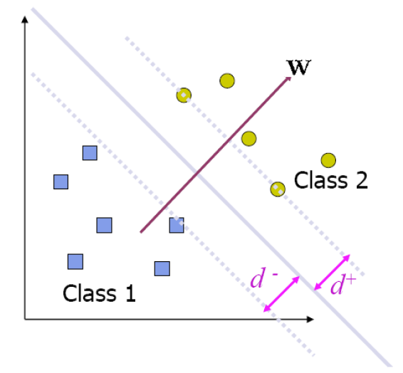

我们的目标是在约束条件下，使间隔最大化：
$$
\max_\bold w \ \frac{2c}{||\bold w||}
\\
s.t.\ y(\bold w^T\bold x+b) ≥ c
$$
事实上，这里$c$可以任意取值，因为随着$c$的变化，$\bold w$和$b$也会成比例改变，最终决策结果并不会发生变化。例如，如果将$c$改变为$\lambda c$，则为了满足约束条件，原来符合约束的$\bold w,b$会随之变为$\lambda \bold w, \lambda b$，但最大化的目标$\frac{2c}{||\bold w||}$并没有发生改变（比例系数$\lambda$可以消掉）。最终得到的决策面中，原来的$\bold w^*，b^*$成比例改变为$\lambda \bold w^*，\lambda b^*$。但由于决策标准$c$也成比例改变为$\lambda c$，因而最终的决策结果并没有发生变化。

综上所述，为简化计算，可以令$c=1$。由于最小化$\frac{1}{||\bold w||}$与最大化$||\bold w||^2$等价，因此优化目标也可以写作：
$$
\min _\bold w \ \frac{1}{2}||\bold w||^2
\\
s.t.\ y(\bold w^T\bold x+b) ≥ 1
$$
即为支持向量机模型的基本形式。

### 约束最优化

#### 拉格朗日乘数法

**无约束优化**

无约束优化问题形式如下：
$$
\min f(x)
\\ 
\max f(x) \Rightarrow \min -f(x)
$$
求优化解的方法很简单，只需令$f(x)$对$x$的梯度为0，解出的$x$即为最优解：
$$
\grad_x f(x)=0
$$
如果无法求出解析解，可以采用梯度下降、牛顿法等优化方法逼近最优解。其中，梯度下降如左图所示，坐标下降如右图所示。梯度下降即为每次沿梯度方向更新每个坐标；坐标下降即控制其他坐标不变，每次只沿某一个维度的梯度方向更新一个坐标。

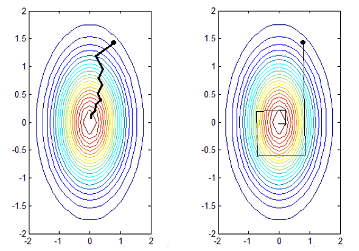

**等式约束优化**

等式约束优化问题形式如下：
$$
\min f(x)
\\
s.t. \ h_i(x)=0, \ i=1,2,...,m
$$
对于等式优化问题，采用拉格朗日乘数法，构造优化函数如下：
$$
L(x)=f(x)+\sum_{i=1}^m\beta_ih_i(x)
$$
优化函数对$x$的梯度为0处即为最优解的取值。这个结论可以从直观上理解。首先以单约束($m=1$)情况为例，$f(x)$的等高线和$h(x)=0$的等高线投影如下图所示，图中箭头的方向表示梯度的反方向。

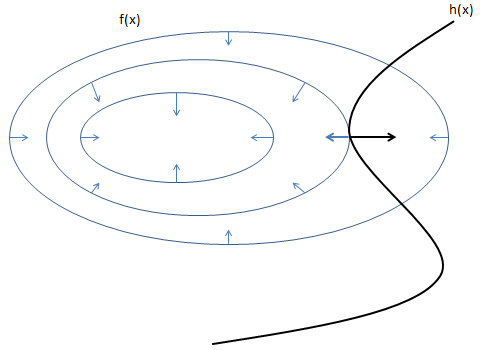

需要注意的是，**梯度方向与等高线垂直**，且**梯度的反向为函数值下降最快的方向**。分析可知，最优解一定在$f(x)$等高线与$h(x)=0$的切点处取值。这是因为在二者的交点处，在$h(x)=0$上沿着$f(x)$梯度的反向移动，$f(x)$的值仍然会变小，所以最小值一定不可能在交点处取；而在合适的切点处，无法继续沿$f(x)$梯度的反向移动，$f(x)$的值不会减小，此时取得最优解。但由于梯度的方向是不能确定的，所以切点处二者梯度的方向关系（同向或反向）是未知的，但我们可以确定切点处二者梯度一定平行（都与切平面垂直），因此满足下式：
$$
\grad_x f(x)+\beta\grad_xh(x)=0
$$
由此可以看出拉格朗日乘数法的合理性。

多约束($m>1$)情况下，$f(x)$与多个约束函数$h_i(x)=0$的共同切点处为最优解，相切处$f(x)$的梯度与多个约束函数梯度的**线性表示**平行：
$$
\grad_x f(x)+\sum_{i=1}^m\beta_i\grad_xh_i(x)=0
$$
在等式约束优化问题中，**系数的取值没有限制**，且$\forall i,\beta_i=0$时代表$f(x)$的极小值点恰好满足所有约束条件。

**不等式约束优化**

不等式约束优化问题的形式如下：
$$
\min f(x)
\\
s.t. \ g_i(x) ≤ 0,  \ i=1,2,...,m
$$
不等式约束优化问题的拉格朗日乘数法如下：
$$
L(x)=f(x)+\sum_{i=1}^m \alpha_ig_i(x)
\\
\forall i, \alpha_i≥0
$$
优化函数对$x$的梯度为0处即为最优解的取值。可以看出不等式约束下的拉格朗日函数与等式约束下基本一致，只不过多了对于系数非负的要求。同样先以单约束($m=1$)情况为例，$f(x)$等高线和$g(x)=0$的等高线如下图所示：

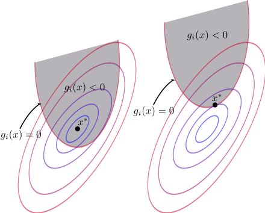

我们分为两种情况讨论，第一种情况如左图所示，$g(x)<0$的区域恰好包含$f(x)$的极值点，则此时最优解就在$f(x)$的极值点处取值，$\alpha=0$；第二种情况如右图所示，$g(x)<0$的区域不包含$f(x)$的极值点。此时的分析方法与最终结果都和等式约束下一致。在可行域内或等高线的交点处，沿着$f(x)$梯度的反向移动，$f(x)$的值仍然会变小，所以最小值一定不可能在交点处取；而在合适的切点处，无法继续沿$f(x)$梯度的反向移动，$f(x)$的值不会减小，此时取得最优解。与等式约束的不同在于，不等式约束提供了梯度方向的信息，$g(x)$的梯度指向可行域外，$f(x)$的梯度指向可行域内，因此二者在切点处反向，下式成立：
$$
\grad_x f(x)+\alpha\grad_xg(x)=0, \ \alpha≥0
$$
同理，多约束($m>1$)情况下，切点处$f(x)$的梯度与多个约束函数梯度的线性组合反向：
$$
\grad_x f(x)+\sum_{i=1}^m\alpha_i\grad_xg_i(x)=0
\\
\forall i, \alpha_i≥0
$$
不等式约束与等式约束下的优化方法基本一致，但不等式约束下多了对拉格朗日乘数法中**系数非负**的限制。同时综上所述，设$x^*$为最优解，可以得出结论：
$$
\left \{
\begin{array}{ll}
    g_i(x^*)<0,     & \alpha_i=0\\
   	g_i(x^*)=0,     & \alpha_i>0\\
\end{array}
\right.
$$

#### 拉格朗日对偶性与对偶问题

**原始问题**

定义约束优化问题：
$$
\min f(x) 
\\
s.t.\ g_i(x)≤0, \ i=1,2,...,m
\\
h_j(x)=0, \ j=1,2,...,n
$$
则拉格朗日函数为：
$$
L(x,\alpha,\beta)=f(x)+\sum_{i=1}^m\alpha_ig_i(x)+\sum_{j=1}^n\beta_jh_j(x)
\\
\forall i, \alpha_i≥0
$$
将拉格朗日函数关于拉格朗日乘子$\alpha,\beta$最大化：
$$
\theta_P(x)=\max_{\alpha,\beta}L(x,\alpha,\beta)
$$
若$x$满足约束条件，则$\alpha_ig_i(x)≤0，\beta_jh_j(x)=0 \Rightarrow  L(x,\alpha,\beta)≤f(x)$；

若$x$不满足约束条件，则一定$\exists {i,j}, \ g_i(x)>0,h_j(x)≠0$，故令$\alpha_i \rightarrow +\infty,\beta_jh_j(x)\rightarrow +\infty$，则$L(x,\alpha,\beta)\rightarrow +\infty$。

因此有：
$$
\theta_P(x)=\left \{
\begin{array}{ll}
    f(x),     & x \ satisfies \ primal \ constraints\\
    +\infty,     & other\\
\end{array}
\right.
$$
在$x$符合约束的条件下,约束问题的解$p^*$为：
$$
p^*=\min_x\theta_P(x)=\min_x\max_{\alpha,\beta}L(x,\alpha,\beta)
$$
原始问题即为拉格朗日函数的极小极大问题，$p^*$为原始问题的最优值。

**对偶问题**
$$
\theta_D(\alpha,\beta)=\min_xL(x,\alpha,\beta)
\\
d^*=\max_{\alpha,\beta}\theta_D(\alpha,\beta)=\max_{\alpha,\beta}\min_xL(x,\alpha,\beta)
$$
对偶问题即为拉格朗日函数的极大极小问题，$d^*$为对偶问题的最优值。

**原始问题与对偶问题的关系**

**定理一（弱对偶）**：对偶问题最优值小于等于原始问题最优值
$$
d^*=\max_{\alpha,\beta}\min_xL(x,\alpha,\beta)≤\min_x\max_{\alpha,\beta}L(x,\alpha,\beta)=p^*
$$
在某些情况下，上式可以取等号。这时对偶问题和原始问题的最优值相等，可以将求解原问题转化为求解对偶问题。

此定理的几何解释可以参考：https://www.zhihu.com/question/58584814

**定理二（强对偶）**：$f(x),g_i(x)$是凸函数，$h_i(x)$是仿射函数，且$g_i(x)$的不等式约束严格可行时($\exists x,s.t. \ \forall i,g_i(x)≤0$)，存在$x^*$是原始问题的解，$\alpha^*,\beta^*$是对偶问题的解，且$d^*=p^*=L(x^*,\alpha^*,\beta^*)$

> 满足定理二的优化问题称为**凸优化**问题：目标函数为**凸函数**，约束条件下的可行解为**凸集**

**定理三（KKT条件）**：当定理二被充分满足时，$x^*$是原始问题的解，$\alpha^*,\beta^*$是对偶问题的解的充分必要条件是：
$$
\grad_xL(x^*,\alpha^*,\beta^*)=0
\\
\forall i,\ \alpha^*_i≥0
\\
\forall i,\ g_i(x^*)≤0
\\
\forall i,\ \alpha^*_ig_i(x^*)=0
\\
\forall j,\ h_j(x^*)=0
$$

#### 对偶算法求解线性可分支持向量机

支持向量机的优化目标为：
$$
\min_\bold w \frac{1}{2}||\bold w||^2
\\
s.t. \ y(\bold w^T\bold x+b)≥1
$$
拉格朗日函数为：
$$
L(\bold w,b,\alpha)=\frac{1}{2}||\bold w||^2+\sum_{i=1}^N\alpha_{i}(1-y^{(i)}(\bold w^T\bold x^{(i)}+b))
$$
$f(x),g_i(x)$均为凸函数，因此可以转化为对偶问题求解，且最终解满足KKT条件。

首先对$\bold w,b$求偏导：
$$
\frac{\part L(\bold w,b)}{\part \bold w}=\bold w-\sum_{i=1}^N\alpha_iy_i\bold x_i=0
\\
\frac{\part L(\bold w,b)}{\part b}=-\sum_{i=1}^N\alpha_iy_i=0
$$
解得：
$$
\bold w=\sum_{i=1}^N\alpha_iy_i\bold x_i
\\
\sum_{i=1}^N\alpha_iy_i=0
$$
代入拉格朗日函数：
$$
\theta_D(\alpha)=\min_{\bold w,b}L(\bold w,b,\alpha)=\sum_{i=1}^N\alpha_i-\frac{1}{2}\sum_{i=1}^N\sum_{j=1}^N\alpha_i\alpha_jy_iy_j(\bold x_i)^T\bold x_j
$$
得到对偶问题：
$$
d^*=\max_\alpha\theta_D(\alpha)=\max_\alpha\sum_{i=1}^N\alpha_i-\frac{1}{2}\sum_{i=1}^N\sum_{j=1}^N\alpha_i\alpha_jy_iy_j(\bold x_i)^T\bold x_j
\\
s.t.\sum_{i=1}^N\alpha_iy_i=0
\\
\forall i,\alpha_i≥0
$$
求得$\alpha_i$，即可得到支持向量机模型：
$$
f(\bold x)=\bold w^T \bold x+b
\\
\Rightarrow f(\bold x)=\sum_{i=1}^N\alpha_iy_i\bold x_i^T\bold x+b
$$
若$f(\bold x)>0$则为正例，$f(\bold x)<0$则为负例。同时，根据KKT条件可以得到：
$$
\alpha_i≥0 \\
1-y_i(\bold w^T\bold x_i+b) ≤0\\
\alpha_{i}(1-y_i(\bold w^T\bold x_i+b))=0
$$
因此，对于支持向量，$1-y^{(i)}(\bold w^T\bold x^{(i)}+b) =0$，则$\alpha_i≥0$；对于其他数据点，$1-y^{(i)}(\bold w^T\bold x^{(i)}+b) ≤0$，故$\alpha_i=0$。因此只有支持向量在计算参数$\bold w$时起作用，最终模型只与支持向量有关。这也是支持向量命名的由来。

在对$\alpha_i$进行求解时，由于$\alpha_i$的个数正比于训练样本数，因此训练的开销是非常大的。在实际应用中，一般采用**SMO算法**提高求解效率。SMO算法的基本思想是，每次选择两个参数$\alpha_i,\alpha_j$进行优化，固定其他参数。根据约束条件$\sum_{i=1}^N\alpha_iy^{(i)}=0$，$\alpha_j$可以由$\alpha_i$表示出来，因此就相当于每轮迭代优化一个参数（约束条件仅有$\alpha_i≥0$），这可以使优化过程高效进行，且可以求得$\alpha_i$的解析解。

每轮迭代中对更新参数$\alpha_i,\alpha_j$的选择也有一定技巧。具体可以参考西瓜书。

得到$\alpha$后就可以得到参数$\bold w$的值，对于参数$b$，一般采用所有支持向量的均值，设支持向量的下标集合为$S$：
$$
1-y_j(\sum_{i \in S}^N\alpha_iy_i\bold x_i^T\bold x_j+b)=0,\forall j \in S
\\
b=\frac{1}{|S|}\sum_{s\in S}(1/y_s-\sum_{i \in S}^N\alpha_iy_i\bold x_i^T\bold x_s)
$$
### 线性支持向量机与正则化

在许多情形下，数据并非线性可分的。这时如果仍然采用“硬间隔”的线性可分支持向量机，则很容易产生过拟合现象，即得到的线性决策面在训练数据上准确率可以接受，但在测试数据上准确率很低。这时的解决方案是引入**松弛变量**$\xi_i$，允许一些数据点在线性决策面下分类错误。

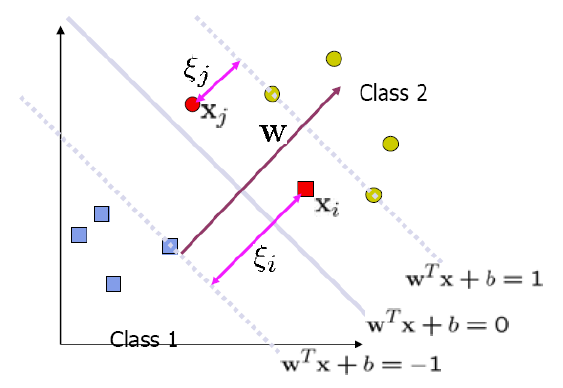

也就是说，“软间隔”的线性支持向量机允许存在数据点不满足原始约束条件：
$$
y_i(\bold w^T\bold x_i+b)≥1
$$
因此，约束条件被修正为：
$$
y^{(i)}(\bold w^T\bold x^{(i)}+b)≥1-\xi_i
\\
\xi_i≥0
$$
由于我们不希望有太多的点不满足原始约束条件，因此要为每个松弛变量添加一个惩罚，进而优化问题被修正为：
$$
\min \frac{1}{2}||\bold w||^2+C\sum_{i=1}^N\xi_i
\\
s.t.\ y_i(\bold w^T\bold x_i+b)≥1-\xi_i
\\
\xi_i≥0
$$
拉格朗日函数为：
$$
L(\bold w,\xi, b, \alpha ,\mu)=\frac{1}{2}||\bold w||^2+C\sum_{i=1}^N\xi_i+\sum_{i=1}^N\alpha_i(1-\xi_i-y_i(\bold w^T\bold x_i+b))-\sum_{i=1}^N\mu_i\xi_i
$$
该优化问题是凸优化问题，因此可以利用对偶算法求解。首先对$\bold w,b,\xi$求偏导：
$$
\frac{\part L(\bold w,\xi, b, \alpha ,\mu)}{\part \bold w}=\bold w-\sum_{i=1}^N\alpha_iy_i\bold x_i=0
\\
\frac{\part L(\bold w,\xi, b, \alpha ,\mu)}{\part b}=-\sum_{i=1}^N\alpha_iy_i=0
\\
\frac{\part L(\bold w,\xi, b, \alpha ,\mu)}{\part \xi_i}=C-\alpha_i-\mu_i=0
$$
解得：
$$
\bold w=\sum_{i=1}^N\alpha_iy_i\bold x_i
\\
\sum_{i=1}^N\alpha_iy_i=0
\\
C=\alpha_i+\mu_i
$$
代入拉格朗日函数：
$$
\theta_D(\alpha,\mu)=\min_{\bold w,b,\xi}L(\bold w,\xi, b, \alpha ,\mu)= \sum_{i=1}^N\alpha_i-\frac{1}{2}\sum_{i=1}^N\sum_{j=1}^N\alpha_i\alpha_jy_iy_j\bold x_i^T\bold x_j
$$
得到对偶问题：
$$
\max_{\alpha}\theta_D(\alpha,\mu)=\max\sum_{i=1}^N\alpha_i-\frac{1}{2}\sum_{i=1}^N\sum_{j=1}^N\alpha_i\alpha_jy_iy_j\bold x_i^T\bold x_j
\\
s.t.\ \sum_{i=1}^N\alpha_iy_i=0
\\
0≤\alpha_i≤C
$$
可以看出， 线性支持向量机与线性可分支持向量机的唯一不同就在于$\alpha_i$的取值范围。线性可分支持向量机仅要求$\alpha_i≥0$，而线性支持向量机要求$0≤\alpha_i≤C$。因此，可以用相同方式（SMO算法）求解该问题的最优解。

最终得到的决策面为：
$$
f(\bold x)=\sum_{i=1}^N\alpha_iy_i\bold x_i^T\bold x+b
$$
若$f(\bold x)>0$则为正例，$f(\bold x)<0$则为负例。线性支持向量机最终得到的仍然是线性决策面，只不过松弛变量的引入允许了支持向量机在一些训练样本上出错，从而提升了泛化能力，能够提升对线性不可分数据进行分类的准确率。

根据KKT条件：
$$
\alpha_i(1-\xi_i-y_i(\bold w^T\bold x_i+b))=0
\\
\alpha_i≥0
\\
1-\xi_i-y_i(\bold w^T\bold x_i+b)≤0
\\
\mu_i\xi_i=0
\\
\mu_i≥0
\\
\xi_i≥0
$$
可以发现，当$y_i(\bold w^T\bold x_i+b)>1-\xi_i$时，$\alpha_i=0$一定成立，因此非支持向量在分类时不起作用。真正起决定作用的仍然是满足$y_i(\bold w^T\bold x_i+b)=1-\xi_i$的支持向量，支持向量对应的$\alpha_i>0$。只不过这些数据点不仅分布在间隔边界上，还可能在间隔边界内部。在所有的支持向量中，若$0<\alpha_i<C$，则$\mu_i>0,\xi_i=0$，该支持向量位于间隔边界上；若$\alpha_i=C$，则$\mu_i=0,\xi_i>0$，该支持向量位于间隔边界内部：$\xi_i<1$则分类正确，$\xi_i>1$则分类错误。

**hinge loss**

我们也可以从损失函数的角度来理解线性支持向量机。实际上，**松弛向量与hinge loss等价**，hinge loss定义如下：
$$
l_{hinge}(z) = max(0,1-z)
$$
则松弛向量$\xi_i$实际上就相当于$l_{hinge}(y_i(\bold w^T\bold x_i+b))$，当能将样本点以间隔界限正确分类时，$y_i(\bold w^T\bold x_i+b)≥1$，hinge loss为0；否则hinge loss表示以间隔边界为基准的分类误差。因此，线性支持向量机也可以看作是最小化损失函数：
$$
L(\bold w, b)=l_{hinge}(y_i(\bold w^T\bold x_i+b))+\lambda||\bold w||^2
$$
其中第一项是对数据分类的hinge loss，衡量分类的误差；第二项是参数$\bold w$的正则化项，控制模型的复杂程度。

> 二分类真正的损失函数是0-1损失函数：
> $$
> l_{0-1}(z)=\left \{
> \begin{array}{ll}
>     0,     & z<0\\
>     1,     & z≥0\\
> \end{array}
> \right.
> $$
> 但是由于0-1损失函数性质不好，非连续可导，因此实际中采用其他性质较好的函数来替代0-1损失函数，这些函数称为“替代损失”。
>
> 替代损失函数包括上述的hinge loss，以及指数损失、对率损失等（详见西瓜书）。

### 非线性支持向量机与核技巧

对于非线性的数据，我们可以通过将其**映射到高维空间**，变成线性可分的数据后，再利用SVM分类。低维非线性的数据在映射到合适的高维空间后，是可以变成线性或者线性可分的，但这对高维空间的选择有很高的要求。我们先假设对于数据$\bold x$，在通过映射$\phi$变换到高维空间后，$\phi(\bold x)$线性可分。那么支持向量机的优化问题为：
$$
\min \frac{1}{2}||\bold w||^2
\\
s.t.\ y_i(\bold w^T\phi(\bold x)+b)≥1
$$
拉格朗日函数为：
$$
L(\bold w,b,\alpha)=\frac{1}{2}||\bold w||^2+\sum_{i=1}^N\alpha_i(1-y_i(\bold w^T\phi(\bold x)+b))
$$
其对偶问题为：
$$
\max \sum_{i=1}^N\alpha_i-\sum_{i=1}^N\sum_{j=1}^N\alpha_i\alpha_jy_iy_j\phi(\bold x_i)^T\phi(\bold x_j)
\\
s.t.\ \alpha_i≥0
\\
\sum_{i=1}^N \alpha_iy_i=0
$$
求解后得到决策面：
$$
f(\bold x)=\sum_{i=1}^N\alpha_iy_i\phi(\bold x_i)^T\phi(\bold x)+b
$$
可以看出，问题的求解涉及到高维向量之间的内积。但是由于向量可能维度很大甚至是无穷维，内积计算通常十分困难。因此利用**核技巧**，意图将高维向量的内积转化为低维向量的函数运算：
$$
\kappa(\bold x_i,\bold x_j)=\phi(\bold x_i)^T\phi(\bold x_j)
$$
$\kappa(\bold x_i,\bold x_j)$被称为核函数。

对偶问题可以重写为：
$$
\max \sum_{i=1}^N\alpha_i-\sum_{i=1}^N\sum_{j=1}^N\alpha_i\alpha_jy_iy_j\kappa(\bold x_i,\bold x_j)
\\
s.t.\ \alpha_i≥0
\\
\sum_{i=1}^N \alpha_iy_i=0
$$
决策面为：
$$
f(\bold x)=\sum_{i=1}^N\alpha_iy_i\kappa(\bold x_i,\bold x_j)+b
$$
**核函数**

什么样的函数才能作为核函数呢？核函数的定理为：$\kappa$是核函数当且仅当对于任意数据$D={\bold x_1, \bold x_2, ..., \bold x_m}$，由$\kappa$定义的核矩阵$\bold K$总是半正定的。

只要满足上述定理，一个函数就可以作为核函数使用，且这个函数对应一个到高维空间的映射$\phi$。因此选择核函数就是选择高维映射，这也是非线性支持向量机的**最大变数**。如果核函数选择不恰当，数据点就相当于被映射到不合适的高维空间，导致仍然是非线性状态，支持向量机性能仍然不佳。

## 聚类算法

### 概述

聚类属于无监督学习。在无监督学习中，训练数据不带有类别标签，但我们仍可以利用一些算法学习到其中的一些特征，例如聚类、概率密度估计、主成分分析（线性）、流形分析（非线性）等。

聚类算法的目的是将训练数据划分为互不相交的子集，称为**簇**。每个子集（簇）具有一些特定的特征，可能与潜在的概念相对应。我们期望得到的簇具有较大的**簇内相似度**和较小的**簇间相似度**。

### 度量相似度

那么，我们应该如何度量数据点之间的相似度呢？相似度通常通过距离函数$dist(·， ·)$来衡量。这要求距离度量函数满足以下性质：

1. 非负性：$dist(\bold x_i,\bold x_j)≥0$
2. 同一性：$dist(\bold x_i,\bold x_j)=0$当且仅当$\bold x_i=\bold x_j$
3. 对称性：$dist(\bold x_i,\bold x_j)=dist(\bold x_j,\bold x_i)$
4. 传递性：$dist(\bold x_i,\bold x_k)+dist(\bold x_k,\bold x_j)≤dist(\bold x_i,\bold x_j)$

**闵可夫斯基距离(Minkowski distance)**

闵可夫斯基距离用两个向量的$L_p$范数来度量距离：
$$
dist_{mk}=(\sum_{i=1}^{d}|x_{id}-x_{jd}|^p)^{\frac{1}{p}}
$$
$p=2$时，闵可夫斯基距离为欧氏距离：
$$
dist_{ed}=\sqrt{\sum_{i=1}^{d}|x_{id}-x_{jd}|^2}
$$
$p=1$时，闵可夫斯基距离为曼哈顿距离：
$$
dist_{man}=\sum_{i=1}^{d}|x_{id}-x_{jd}|
$$
$p=+\infty$时，闵可夫斯基距离为sup距离：
$$
dist_{sup}=\max_{1≤i≤d}|x_{id}-x_{jd}|
$$
**汉明距离**：度量码字之间的距离

**相关系数**

皮尔逊相关系数：
$$
s(x,y)=\frac{\sum_{i=1}^n(x_i-\bar x)(y_i-\bar y)}{\sqrt{\sum_{i=1}^n(x_i-\bar x)^2\sum_{i=1}^n(y_i-\bar y)^2}}
$$
**编辑距离**：将一个样本转化为与另一个相同所付出的代价（一般用于衡量字符串之间的距离）

### 层次聚类

层次聚类分为两种：自底向上的聚合和自顶向下的分裂。

在自底向上的聚类中，首先将每个样本看作一个类别，根据类之间的距离大小选择最近的两类进行合并，得到一个新的类。重复上述操作直到满足停止条件。

在自顶向下的分裂中，首先将所有样本看作一个类别，然后选择距离最远的两个样本分到两个新的类。重复上述操作直到满足停止条件。但自顶向下的聚合方法很少被使用。

因此，在层次聚类算法中，我们需要定义距离度量以及衡量类别之间距离的方法。通常有以下四种方式用于衡量类间距：

1. single-link(最短距离)：$D_{pq}=\min\{dist_{ij}|\bold x_i\in G_p, \bold x_j \in G_q\}$
2. complete-link(最长距离)：$D_{pq}=\max\{dist_{ij}|\bold x_i\in G_p, \bold x_j \in G_q\}$
3. centroid(中心距离)：$D_{pq}=dist(\bar{\bold x_p},\bar{\bold x_q)})$，两类中心间的距离
4. average-link(平均距离)：$D_{pq}=\frac{1}{n_pn_q}\sum_{\bold x_i \in G_p}\sum_{\bold x_j \in G_q}dist_{ij}$

时间复杂度：$O(n^3d)$（朴素）或$O(n^2d\log n )$（堆排）

层次聚类的过程可以用Dendrogram表示如下：

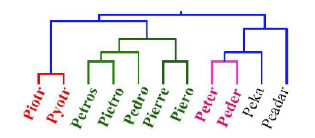

### KMeans

算法流程：

1. 随机初始化聚类中心。
2. 计算每个样本点到聚类中心的距离，将其标记为属于与其距离最小的中心对应的类别。
3. 对每个类别重新计算其聚类中心$\mu_k=\frac{1}{C_k}\sum_{\bold x_i \in C_k}\bold x_i$。
4. 重复步骤2-3直到满足停止条件。

时间复杂度：$O(lKn)$

初始聚类中心的选择和选择的类别数$K$的大小都对KMeans算法的性能有很大的影响。不好的初始化点（距离太近或太远）都导致收敛速度很慢或收敛到局部最优解。因此我们需要尝试多种初始化方式，或用其他算法（如层次聚类）的结果作为KMeans的初始化。不恰当的$K$也会导致聚类结果变差，选择$K$实际上就是在类别数和簇内相似度之间寻找trade-off。可以通过估计$P(K|data)$并加入对类别数过多的惩罚（参数方法），或依据样本数和类别数的函数关系来得到合适的$K$（非参数方法）。

> KMeans算法是收敛的。具体证明会在混合模型部分详细讨论。

KMeans可以被应用于**图像压缩**、**图像分割**（详见PRML）

## 混合模型与EM算法

混合模型是指混合概率分布，它比单独的概率分布更加强大，可以用于描述更复杂的数据分布。混合模型也可以用于聚类，事实上，KMeans就是混合高斯模型聚类的一个特殊情况。首先，我们讨论KMeans的严谨数学证明，然后引出混合高斯模型以及EM算法。

### KMeans的数学证明

在聚类问题中，我们期望每个类别的类间相似度尽可能大，因此我们定义$J$表示所有数据点与其所在类的类别中心之间的距离之和：
$$
J=\sum_{n=1}^N\sum_{k=1}^Kr_{nk}||\bold x_n-\mu_k||^2
$$
其中$r_{nk}\in{0,1}$表示数据点$\bold x_n$被分入哪个类别。我们最终希望得到每个数据点的分类结果$r_{nk}$以及类别中心$\mu_k$。其中分类的标准可以设定为将数据点分入距离其最近的类别中心对应的类：
$$
r_{nk}=\left \{
\begin{array}{ll}
 1,     & k=\mathop{argmin}\limits_j||\bold x_n-\mu_j||^2\\
 0,     & others\\
\end{array}
\right.
$$
如果我们固定$r_{nk}$，将$J$关于$\mu_k$求导，我们可以得到：
$$
\frac{\part J}{\part \mu_k}=\sum_{n=1}^N2r_{nk}(\bold x_n-\mu_k)=0
$$
令偏导为0，解得：
$$
\mu_k=\frac{\sum_{n=1}^Nr_{nk}\bold x_n}{\sum_{n=1}^Nr_{nk}}=\frac{1}{C_k}\sum_{\bold x_i \in C_k}\bold x_i
$$
因此可以分成两个步骤分别对$r_{nk}$和$\mu_k$进行更新，先初始化聚类中心，根据与聚类中心的距离对每个数据点进行分类更新$r_{nk}$，再根据新的$r_{nk}$重新计算聚类中心$\mu_k$。这实际上就是KMeans的算法过程。**由于每个阶段都使$J$的值减小，因此KMeans算法是收敛的**。但是在初始化不好的情况下有收敛到局部最优解的可能。在后面我们还会看到，这实际上就是EM算法的应用，更新$r_{nk}$是E步骤，更新$\mu_k$是M步骤。

### 混合高斯模型(GMM)

**几何角度：线性叠加**

混合高斯模型可以看作是高斯分布的线性叠加：
$$
p(\bold x)=\sum_{k=1}^K\pi_k\mathcal N(\bold x|\mu_k,\Sigma_k)
$$
**生成角度：隐变量**

混合高斯模型实际上是形式最简单的生成式模型。引入隐变量$\bold z$，满足：
$$
p(z_k=1)=\pi_k
\\
p(\bold z)=\prod_{k=1}^K\pi_k^{z_k}
$$
其中$\bold z$的表示方法称为“1-of-K”，即$z_k \in \{0,1\}$且$\sum_{k=1}^Kz_k=1$，即$\bold z$只有一个维度$z_k$为1，表示类别标签为$k$。

则在已知类别标签的情况下，$\bold x$满足分布：
$$
p(\bold x|z_k=1)=\mathcal N(\bold x|\mu_k,\Sigma_k)
\\
p(\bold x|\bold z)=\prod_{k=1}^K\mathcal N(\bold x|\mu_k,\Sigma_k)^{z_k}
$$
进而可以得到$\bold x,\bold z$的联合分布：
$$
\begin{align}
p(\bold x,\bold z)
&=p(\bold z)p(\bold x|\bold z)\\
&=\prod_{k=1}^K\pi_k^{z_k}\mathcal N(\bold x|\mu_k,\Sigma_k)^{z_k}
\end{align}
$$
从而可以推出$\bold x$的边缘分布：
$$
p(\bold x)=\sum_{\bold z}p(\bold x, \bold z)=\sum_{k=1}^K\pi_k\mathcal N(\bold x|\mu_k,\Sigma_k)
$$
也可以得到与几何角度相同的定义式。

还有一个比较重要的量：
$$
\begin{align}
\gamma_{nk}
&=p(z_k=1|\bold x_n)\\
&=\frac{p(\bold x_n,z_k=1)}{p(\bold x_n)}\\
&=\frac{\pi_k\mathcal N(\bold x_n|\mu_k,\Sigma_k)}{\sum_j\pi_j\mathcal N(\bold x_n|\mu_j,\Sigma_j)}\\
\end{align}
$$
$\gamma_{nk}$为在观测到$\bold x_n$下，$z_k=1$的后验概率，可以看作**分量$z_k$对于解释$\bold x_n$的责任**。

可以看出，数据点$\bold x$的分布是在隐变量$\bold z$的基础上生成的，因此高斯混合模型实际上也是一个生成模型，可以用以下的图模型表示：

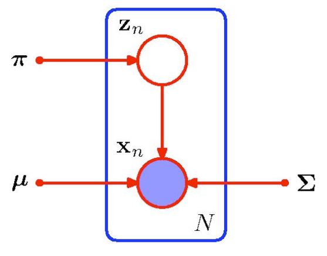

### 最大似然的局限

所有样本$\bold X$的对数似然函数为：
$$
\ln p(\bold X|\pi,\mu,\Sigma)=\sum_n\ln\sum_k\pi_k\mathcal N(\bold x_n|\mu_k, \Sigma_k)
$$
可以发现，求和运算出现在对数运算内部，这导致令似然函数导数为0是无法得到参数的解析解的。分别对$\mu,\Sigma$求偏导为0、对$\pi$根据$\sum_k\pi_k=0$约束优化得：
$$
\mu_k=\frac{1}{N_k}\sum_{n=1}^N\gamma_{nk}\bold x_n
\\
\Sigma_k=\frac{1}{N_k}\sum_{n=1}^N\gamma_{nk}(\bold x_n-\mu_k)(\bold x_n-\mu_k)^T
\\
\pi_k=\frac{N_k}{N}
\\
N_k=\sum_{n=1}^N\gamma_{nk}
$$
其中$N_k$可以看作是分到类别$k$的数据点的有效数量。根据上述公式，我们并不能得到参数的解析解，只能通过优化的方式无限逼近最优解。梯度下降是可行的，但通常采用EM算法。

**协方差矩阵奇异性**

在讨论EM算法之前，先来说明GMM存在的矩阵奇异性问题。GMM存在将某个高斯分量的协方差矩阵更新为奇异矩阵的可能，因为这样也会使似然函数增大。考虑第$j$个高斯分量的协方差矩阵$\Sigma_j=\sigma_j^2I$，令$\sigma_j \rightarrow 0$，该高斯分量退化为一个数据点$\mu_j$。若此时存在$\bold x_j=\mu_j$，则对于这个数据点来说，其似然函数趋于无穷：
$$
p(\bold x_j|\mu,\Sigma,\pi) \propto  \frac{1}{\sigma_j}
$$
而对于其他的数据点$\bold x_n$，其与该高斯分量的均值间的距离$||\bold x_n-\mu_j||^2≠0$，则该高斯分量在似然函数中对应的那一项趋于0。但由于似然函数中还包括未退化为一个数据点高斯分量所对应的项，该点的似然函数不会为0，也就使得总样本的似然函数在存在奇异矩阵的情况下增加迅速。因而混合模型允许奇异协方差矩阵的产生。这时混合高斯模型的分布如下图所示：

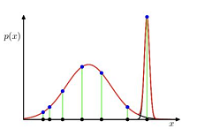

为了避免这个现象，可以重新初始化，重新设定均值，并将方差设定为较大值。除此之外，我们还可以为参数添加先验。例如，添加协方差矩阵的先验$p(\Sigma)$，待优化的函数从对数似然函数变为$\ln p(\bold X|\mu,\Sigma,\pi)+ \ln p(\Sigma)$，这就相当于在更新$\Sigma$时添加了一个较小的正则化项避免其为0。

实际上，产生奇异性的协方差矩阵也可能是由于数据本身的原因。如果数据在某一维度上本身方差较小，则该维度在协方差矩阵中对应的对角项为0，也可能会产生这个现象。这时我们可以为这个维度添加噪声或进行主成分分析对数据降维。【这一段没有参考，我自己的直觉理解，仍有待考证。】

### EM算法

#### GMM

虽然我们无法通过似然函数求导为0得到解析解，但这为我们提供了一种迭代求解的方式。首先初始化$\mu_k,\Sigma_k,\pi_k$（随机初始化或利用KMeans的结果进行初始化），分别计算出每个数据点的责任：
$$
\gamma_{nk}=\frac{\pi_k\mathcal N(\bold x_n|\mu_k,\Sigma_k)}{\sum_{j=1}^K\pi_j\mathcal N(\bold x_n|\mu_j,\Sigma_j)}
$$
根据计算出的责任$\gamma_{nk}$，对$\mu_k,\Sigma_k,\pi_k$进行更新：
$$
\mu_j^{new}=\frac{1}{N_k}\sum_{n=1}^N\gamma_{nk}\bold x_n
\\
\Sigma_k^{new}=\frac{1}{N_k}\sum_{n=1}^N(\bold x_n-\mu_k)(\bold x_n-\mu_k)^T
\\
\pi_k^{new}=\frac{N_k}{N}
$$
其中$N_k=\sum_{n=1}^N\gamma_{nk}$。最后，计算对数似然函数：
$$
L(\mu,\Sigma,\pi)=\ln p(\bold X|\mu,\Sigma,\pi)=\sum_{n=1}^N\ln\sum_{k=1}^K\pi_k \mathcal N(\bold x_n|\mu_k,\Sigma_k)
$$
检查对数似然函数的收敛性，如果未满足收敛准则，则利用更新后的$\mu,\Sigma,\pi$计算责任$\gamma_{nk}$，并重复上述更新步骤。

实际上，这就是EM算法的基本流程。计算$\gamma_{nk}$称为E步骤，更新参数$\mu,\Sigma,\pi$称为M步骤。

**GMM中EM算法的理解**

从生成模型的角度来理解EM算法的引入更加清晰。在生成模型中，我们引入了隐变量$\bold z$，我们称$\{\bold x, \bold z\}$为完整数据，$\{\bold x\}$为部分数据。部分数据的对数似然函数即为：
$$
\ln p(\bold X|\mu,\Sigma,\pi)=\sum_{n=1}^N \ln \sum_{k=1}^K \pi_k \mathcal N(\bold x_n|\mu_k,\Sigma_k)
$$
但是正如前文所说，求和运算出现在对数运算内部，导致求解困难，因此我们可以转而考虑完整数据的似然函数：
$$
p(\bold X,\bold Z|\mu,\Sigma,\pi)=\prod_{n=1}^N \prod_{k=1}^K \pi_k^{z_{nk}}\mathcal N(\bold x_n|\mu_k,\Sigma_k)^{z_{nk}}
$$
完整数据的对数似然函数为：
$$
\begin{align}
\ln p(\bold X,\bold Z|\mu,\Sigma,\pi)&=\sum_{n=1}^N \sum_{k=1}^K \ln(\pi_k^{z_{nk}}\mathcal N(\bold x_n|\mu_k,\Sigma_k)^{z_{nk}})\\
&=\sum_{n=1}^N \sum_{k=1}^Kz_{nk}(\ln\pi_k+\ln\mathcal N(\bold x_n|\mu_k,\Sigma_k))
\end{align}
$$
完整数据的似然函数中，求和运算在对数运算外部，使似然函数计算变得简便。但是这时引入隐变量$\bold z$出现的问题是，我们**无法从数据中直接观测得到$\bold z$的值，只能估计在观测到$\bold x$的条件下$\bold z$的后验概率，进而用原似然函数在该后验概率分布下的期望代替原似然函数**：
$$
p(\bold Z|\bold X,\mu,\Sigma,\pi)=\frac{\prod_{n=1}^N \prod_{k=1}^K \pi_k^{z_{nk}}\mathcal N(\bold x_n|\mu_k,\Sigma_k)^{z_{nk}}}{\prod_{n=1}^N\sum_{k=1}^K\pi_k \mathcal N(\bold x_n|\mu_k,\Sigma_k)}
\\
\mathbb E(z_{nk})=z_{nk}·p(z_k=1|\bold x_n,\mu,\Sigma,\pi)=\frac{\pi_k\mathcal N(\bold x_n|\mu_k,\Sigma_k)}{\sum_{j=1}^K\pi_j\mathcal N(\bold x_n|\mu_j,\Sigma_j)}=\gamma_{nk}
$$
因此完整数据的似然函数在$\bold z$的后验概率下的期望为：
$$
\begin{align}
\mathbb E_\bold Z(\ln p(\bold X,\bold Z|\mu,\Sigma,\pi))&=\sum_{n=1}^N \sum_{k=1}^K\mathbb E(z_{nk})(\ln\pi_k+\ln\mathcal N(\bold x_n|\mu_k,\Sigma_k))\\
&=\sum_{n=1}^N \sum_{k=1}^K\mathbb \gamma_{nk}(\ln\pi_k+\ln\mathcal N(\bold x_n|\mu_k,\Sigma_k))
\end{align}
$$
EM算法的步骤即为，首先利用$\mu^{old},\Sigma^{old},\pi^{old}$计算责任$\gamma$（E步骤），再固定$\gamma$最大化上述期望，得到$\mu^{new},\Sigma^{new},\pi^{new}$（M步骤）。其中$\mu^{new},\Sigma^{new},\pi^{new}$的更新公式如前文所示。

EM算法可以形式化表示如下：
$$
Q(\theta^{old},\theta)=\sum_{\bold Z} p(\bold Z|\theta^{old}) \ln p(\bold X,\bold Z|\theta)
$$
E步骤：求解$p(\bold Z|\theta^{old})$

M步骤：使$Q(\theta^{old},\theta)$最大化得到$\theta = \theta^{new}$

#### KMeans

KMeans实际上是GMM的特殊情况，其更新过程也可以看作是EM算法的应用。在GMM的基础上，设$\Sigma_k=\epsilon I$，令$\epsilon \rightarrow 0$，所有高斯分量退化为一个数据点$\mu_k$，则对于一个数据点$\bold x_n$，其对应的责任为：
$$
\begin{align}
\gamma_{nk}&=\frac{\pi_k\mathcal N(\bold x_n|\mu_k,\Sigma_k)}{\sum_{j=1}^K\pi_j\mathcal N(\bold x_n|\mu_j,\Sigma_j)} \\
&=\frac{\pi_k\exp(-\frac{||\bold x_n-\mu_k||^2}{2\epsilon^2})}{\sum_{j=1}^K\pi_j\exp(-\frac{||\bold x_n-\mu_j||^2}{2\epsilon^2})}
\end{align}
$$
对于与$\bold x_n$距离较近的$\mu_k$，$\gamma_{nk} \rightarrow 1$，否则$\gamma_{nk} \rightarrow 0$。也就是说：
$$
\gamma_{nk}=\left \{
\begin{array}{ll}
 1,     & k=\mathop{argmin}\limits_j||\bold x_n-\mu_j||^2\\
 0,     & others\\
\end{array}
\right.
$$
进而就得到了KMeans算法，其似然函数在$\bold z$后验概率下的期望为：
$$
\mathbb E_\bold Z(\ln p(\bold X,\bold Z|\mu,\Sigma,\pi))=-\frac{1}{2}\sum_{n=1}^N \sum_{k=1}^Kr_{nk} ||x_n-\mu_k||^2+C
$$
其中$C$为常数。故更新$r_{nk}$即对每个点赋予类别标签的过程为E步骤，重新计算$\mu_k$使似然函数期望最大即更新参数的过程为M步骤。

#### EM算法的收敛性与变分界限

我们的目的是最大化部分数据的似然函数$p(\bold X|\theta)$，为什么引入隐变量，并利用EM算法优化完整数据似然函数的期望$\mathbb E_\bold Z( p(\bold X,\bold Z| \theta))$仍然有效呢？接下来将运用变分推断的思想对这个问题加以证明。

首先拆解对数似然函数$\ln p(\bold X|\theta)$:
$$
\begin{align}
\ln p(\bold X|\theta)
&=\sum_\bold Z q(\bold Z) \ln \frac{p(\bold X,\bold Z|\theta)}{q(\bold Z)}-\sum_\bold Zq(\bold Z) \ln \frac{p(\bold Z|\bold X,\theta)}{q(\bold Z)} \\
&=L(q,\theta)+KL(q||p)
\end{align}
$$
其中$q(\bold Z)$表示估计的$\bold Z$的分布。由于$KL(q||p)≥0$，则$\ln p(\bold X|\theta)≥L(q,\theta)$，$L(q,\theta)$是对数似然的一个下界，可以形式化表示为：

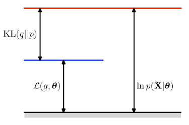

在EM算法的E步骤中，固定$\theta=\theta^{old}$，计算$p(\bold Z|\theta^{old})$，就是在使估计的$q(\bold Z)$与$\bold Z$的后验概率分布尽可能靠近，最终优化结果是$KL(q||p)=0$，$L(q,\theta^{old})=\ln p(\bold X|\theta^{old})$：

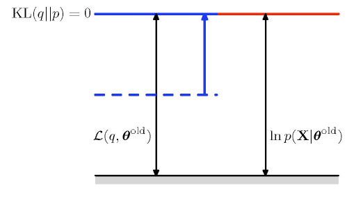

在M步骤中，固定$q(\bold Z)$，使$\theta=\theta^{new}$以最大化$\mathbb E_\bold Z(p(\bold X,\bold Z|\theta^{new}))$。这时由于更新了$\theta^{new}$，$L(q,\theta)$增大；而$q(\bold Z)$未变但$p(\bold Z|\theta^{new})$发生变化，因此衡量二者距离的$KL(q||p)$也会增大：

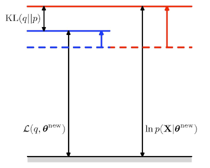

因此随着EM算法的迭代，对数似然函数$p(\bold X|\theta)$必定保持增大的趋势，逐渐向最优值靠近：

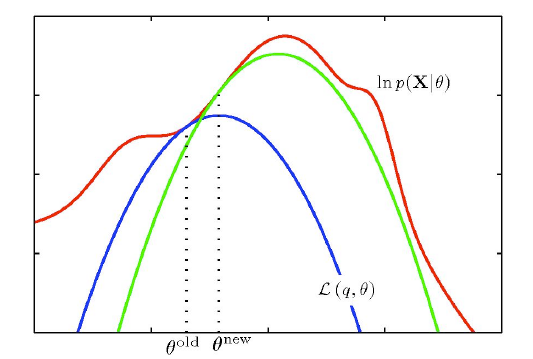

这部分内容对于理解EM算法十分重要，这里只叙述了核心思想，详见PRML。

## 主成分分析

GMM中的隐变量是离散的，但某些情况下存在连续的隐变量。主成分分析(PCA)就可以用于从数据点中提取出这些隐变量。主成分分析的推导有两种方式，一种是最大方差的角度，另一种是最小误差的角度。

### 最大方差

假设我们要进行主成分分析的数据样本为$\bold X=\{\bold x_1, \bold x_2,...,\bold x_n\}$，维度为$D$。我们希望将其投影到维度为$M≤D$的空间，尽可能多地保留其信息。也就是说，使得投影后的数据点方差尽可能大，这样更多的特征才能被保留。先以投影到一维数据($M=1$)的情况为例，设投影方向为$u_1$，$u_1$维度为$D$，$\bold x_n$投影后的点为$u_1^T\bold x_n$。由于$u_1$仅表示投影方向，故其长度可以任意设定，我们令其为单位向量，即$u_1^Tu_1=1$。投影后数据点的均值为：
$$
M=u_1 \bar{\bold x}=\frac{1}{N}\sum_{n=1}^Nu_1^T\bold x_n
$$
投影后数据点的方差为：
$$
V=\frac{1}{N}\sum_{n=1}^N(u_1^T\bold x_n-u_1^T\bar{\bold x})(u_1^T\bold x_n-u_1^T\bar{\bold x})^T=u_1^TSu_1
\\
S=\frac{1}{N}\sum_{n=1}^N(\bold x_n-\bar{\bold x})(\bold x_n-\bar{\bold x})^T
$$
$S$为原数据的协方差矩阵。

为了使方差最大化，我们对于方差进行约束优化，约束条件是$\mu_1^T\mu_1=1$（为了避免无约束下$||\mu_1||\rightarrow+\infty$）：
$$
S\mu_1=\lambda_1u_1
$$
由此可见$\lambda$是$S$的特征值。根据$\mu_1^T\mu_1=1$可以得到：
$$
u_1^TSu_1=\lambda_1
$$
为了使$V=u_1^TSu_1$最大，使得$\lambda$取协方差矩阵$S$最大的特征值，$u_1$为该特征值对应的特征向量，即可将原数据投影到信息损失最小的主成分空间。

如果$M>1$，即可取协方差矩阵$S$前$M$大的特征值$\lambda_1,\lambda_2,...\lambda_M$所对应的特征向量$u_1,u_2,...,u_M$作为投影方向。**由于协方差矩阵$S$是对称阵，故其特征向量是相互正交的**，可以看作是低维空间中的一组基向量。

### 最小误差

将每个数据点看作是一组单位基向量$\{u_i\}_{i=1}^D$的线性组合：
$$
\bold x_n=\sum_{i=1}^D\alpha_{ni}u_i
$$
由于$u_i^Tu_i=1$，故$\alpha_{ni}=\bold x_n^Tu_i$，从而：
$$
\bold x_n=\sum_{i=1}^D(\bold x_n^Tu_i)u_i
$$
如果我们要将$\bold x_n$从$D$维降到$M$维，则令$u_1,...u_M$与具体数据点有关，而$u_{M+1},...,u_D$与数据点无关：
$$
\widetilde{\bold x}_n=\sum_{i=1}^M z_{ni}u_i+\sum_{i=M+1}^D b_iu_i
$$
其中$z_{ni}$与具体数据点相关，而$b_i$与具体数据无关。定义函数$J$表示$\bold x_n$与$\widetilde {\bold x}_n$之间的距离：
$$
J=\frac{1}{N}\sum_{n=1}^N||\bold x_n-\widetilde{\bold x}_n||^2
$$
为了最小化$J$，使$J$关于$z_{ni},b_i$求偏导得：
$$
z_{ni}=\bold x_n^Tu_i \ (i=1,2,...,M)
\\
b_i=\bar{\bold x}^Tu_i \ (i=M+1,...,D)
$$
将$z_{ni},b_i$分别带入原式得到：
$$
\begin{align}
\widetilde{\bold x}_n& =\sum_{i=1}^M (\bold x_n^Tu_i)u_i+\sum_{i=M+1}^D (\bar{\bold x}^Tu_i)u_i
\\
J& =\frac{1}{N}\sum_{n=1}^N \{\sum_{i=M+1}^D [(\bold x_n^T-\bar{\bold x}^T)u_i]u_i\}^2\\
&=\sum_{i=M+1}^Du_i^TSu_i
\end{align}
$$
同理，将$J$关于$u_i$在$u_i^Tu_i$的约束下求导，得到：
$$
Su_i=\lambda_iu_i
\\
u_i^TSu_i=\lambda_i
$$

因此有：
$$
J=\sum_{i=M+1}^D\lambda_i
$$
故只需将这些特征值取为$S$的$D-M$个最小的特征值，令$u_{M+1},...,u_D$为所对应的特征向量即可令误差最小，从而$u_1,...,u_M$为$M$个最大特征值所对应的特征向量，这也与最大方差的推导结果相契合。此时误差为：
$$
\bold x_n-\widetilde{\bold x}_n=\sum_{i=M+1}^D (\bar{\bold x}^Tu_i)u_i
$$

可以看出从$\bold x_n$到$\widetilde {\bold x}_n$的位移向量位于与主子空间垂直的空间中，因为这个位移向量是$\{u_i\}_{i=M+1}^D$的线性组合。

注意当$M=D$时并没有进行维度的压缩，只是将原数据点旋转到主成分方向。
